# Firefly Platform - Distributor Management Service

A comprehensive reactive microservice for managing financial service distributors, their operations, products, and business processes across multiple geographic regions.

## Table of Contents

- [Overview](#overview)
- [Key Features](#key-features)
- [Architecture](#architecture)
- [Data Model](#data-model)
- [New Features](#new-features)
- [Setup and Installation](#setup-and-installation)
- [Quick Start Guide](#quick-start-guide)
- [API Documentation](#api-documentation)
- [Usage Examples](#usage-examples)
- [Configuration](#configuration)
- [Development Guidelines](#development-guidelines)
- [Testing](#testing)
- [Deployment](#deployment)
- [Monitoring](#monitoring)
- [Contributing](#contributing)
- [License](#license)

## Overview

The Distributor Management Service is a reactive Spring Boot microservice that provides comprehensive management capabilities for financial service distributors within the Firefly ecosystem. Built with modern reactive programming principles, it offers high-performance, scalable solutions for distributor lifecycle management, multi-country operations, and dynamic agreement generation.

This service acts as the central hub for all distributor-related operations, providing seamless integration with other microservices while maintaining data consistency and operational compliance across multiple geographic regions.

## Key Features

### 🏢 **Distributor Lifecycle Management**
- Complete distributor onboarding and profile management
- Multi-tier distributor hierarchies and relationships
- Real-time status tracking and lifecycle transitions
- Comprehensive audit logging for compliance

### 🌍 **Multi-Country Operations**
- Geographic coverage tracking across countries and administrative divisions
- Location-based operational authorization and validation
- Dynamic territory management and expansion capabilities
- Compliance monitoring for regional regulations

### 🎯 **Simulation & Application Tracking**
- Integration with external microservices for application tracking
- Real-time simulation status monitoring
- Cross-service data correlation and reporting
- Performance analytics and insights

### 📋 **Dynamic Terms & Conditions Management**
- Template-based agreement generation with variable substitution
- Digital signature workflows and audit trails
- Multi-category template organization (General, Lending, Operational, etc.)
- Auto-renewal and expiration management
- Version control and change tracking

### 🎨 **Customizable Branding**
- Per-distributor branding and theming configurations
- Logo, color scheme, and font customization
- White-label solution support
- Brand consistency enforcement

### 📦 **Product & Lending Management**
- Comprehensive product catalog with categorization
- Flexible lending configuration system
- Multiple lending types support (personal loans, mortgages, installments)
- Leasing contract lifecycle management
- Physical product shipment tracking

### 🔗 **Integration & APIs**
- RESTful API with comprehensive OpenAPI documentation
- Reactive programming for high-performance operations
- Advanced filtering, sorting, and pagination
- Real-time event streaming capabilities

## Architecture

The service follows a clean, modular architecture with clear separation of concerns:

```
common-platform-distributor-mgmt/
├── common-platform-distributor-mgmt-core/       # Business logic and service implementations
├── common-platform-distributor-mgmt-interfaces/ # DTOs and public interfaces
├── common-platform-distributor-mgmt-models/     # Data entities and repositories
├── common-platform-distributor-mgmt-sdk/        # Client SDK for other services
└── common-platform-distributor-mgmt-web/        # REST API controllers and web configuration
```

### Technology Stack

- **Framework**: Spring Boot 3.x with Spring WebFlux for reactive programming
- **Database**: PostgreSQL with Spring Data R2DBC for reactive database access
- **Migration**: Flyway for database schema management
- **Documentation**: OpenAPI 3.0 with Swagger UI
- **Validation**: Jakarta Bean Validation with custom validators
- **Mapping**: MapStruct for entity-DTO mapping
- **Testing**: JUnit 5, Mockito, and Reactor Test
- **Build**: Maven with multi-module structure

### Reactive Architecture Benefits

- **High Throughput**: Non-blocking I/O operations for better resource utilization
- **Scalability**: Efficient handling of concurrent requests
- **Resilience**: Built-in backpressure handling and error recovery
- **Performance**: Optimized for high-load scenarios

## Data Model

The service manages a comprehensive data model with the following core entities and relationships:

```mermaid
erDiagram
    Distributor ||--o{ DistributorBranding : "has"
    Distributor ||--o{ DistributorAuditLog : "has"
    Distributor ||--o{ Product : "offers"
    Distributor ||--o{ LeasingContract : "manages"
    Distributor ||--o{ DistributorOperation : "operates in"
    Distributor ||--o{ DistributorSimulation : "tracks"
    Distributor ||--o{ DistributorTermsAndConditions : "agrees to"
    
    Product ||--o{ LendingConfiguration : "has"
    Product }|--|| ProductCategory : "belongs to"
    Product ||--o{ LeasingContract : "included in"
    Product ||--o{ Shipment : "shipped as"
    
    LendingConfiguration }|--|| LendingType : "has type"
    LendingConfiguration ||--o{ LeasingContract : "used in"
    
    LeasingContract ||--o{ Shipment : "has"
    
    TermsAndConditionsTemplate ||--o{ DistributorTermsAndConditions : "generates"
    
    Distributor {
        Long id PK
        String externalCode
        String name
        String displayName
        String taxId
        String registrationNumber
        String websiteUrl
        String supportPhoneNumber
        String supportEmail
        String addressLine
        String postalCode
        String city
        String state
        String countryCode
        Boolean isActive
        Boolean isTestDistributor
        String timeZone
        String defaultLocale
        LocalDateTime createdAt
        Long createdBy
        LocalDateTime updatedAt
        Long updatedBy
    }
    
    DistributorBranding {
        Long id PK
        Long distributorId FK
        String logoUrl
        String faviconUrl
        String primaryColor
        String secondaryColor
        String backgroundColor
        String fontFamily
        ThemeEnum theme
        Boolean isDefault
        LocalDateTime createdAt
        Long createdBy
        LocalDateTime updatedAt
        Long updatedBy
    }
    
    DistributorAuditLog {
        Long id PK
        Long distributorId FK
        DistributorActionEnum action
        String entity
        String entityId
        JsonNode metadata
        String ipAddress
        Long userId
        LocalDateTime timestamp
    }
    
    Product {
        Long id PK
        Long distributorId FK
        String name
        String description
        String sku
        String modelNumber
        String manufacturer
        ProductCategoryDTO category
        String imageUrl
        JsonNode specifications
        Boolean isActive
        LocalDateTime createdAt
        Long createdBy
        LocalDateTime updatedAt
        Long updatedBy
    }
    
    ProductCategory {
        Long id PK
        String name
        String code
        String description
        Boolean isActive
        LocalDateTime createdAt
        Long createdBy
        LocalDateTime updatedAt
        Long updatedBy
    }
    
    LendingType {
        Long id PK
        String name
        String code
        String description
        Boolean isActive
        LocalDateTime createdAt
        Long createdBy
        LocalDateTime updatedAt
        Long updatedBy
    }
    
    LendingConfiguration {
        Long id PK
        Long productId FK
        String name
        String description
        LendingTypeDTO lendingType
        Integer minTermMonths
        Integer maxTermMonths
        Integer defaultTermMonths
        BigDecimal minInterestRate
        BigDecimal maxInterestRate
        BigDecimal defaultInterestRate
        BigDecimal minAmount
        BigDecimal maxAmount
        BigDecimal defaultAmount
        Integer gracePeriodDays
        Boolean isDefault
        Boolean isActive
        String termsConditions
        LocalDateTime createdAt
        Long createdBy
        LocalDateTime updatedAt
        Long updatedBy
    }
    
    LeasingContract {
        Long id PK
        Long contractId
        Long partyId
        Long distributorId FK
        Long productId FK
        Long lendingConfigurationId FK
        LocalDate startDate
        LocalDate endDate
        BigDecimal monthlyPayment
        BigDecimal downPayment
        BigDecimal totalAmount
        String status
        LocalDateTime approvalDate
        Long approvedBy
        String termsConditions
        String notes
        LocalDateTime createdAt
        Long createdBy
        LocalDateTime updatedAt
        Long updatedBy
    }
    
    Shipment {
        Long id PK
        Long leasingContractId FK
        Long productId FK
        String trackingNumber
        String carrier
        String shippingAddress
        LocalDateTime shippingDate
        LocalDateTime estimatedDeliveryDate
        LocalDateTime actualDeliveryDate
        String status
        String notes
        LocalDateTime createdAt
        Long createdBy
        LocalDateTime updatedAt
        Long updatedBy
    }
    
    DistributorOperation {
        Long id PK
        Long distributorId FK
        Long countryId
        Long administrativeDivisionId
        Boolean isActive
        LocalDateTime createdAt
        Long createdBy
        LocalDateTime updatedAt
        Long updatedBy
    }
    
    DistributorSimulation {
        Long id PK
        Long distributorId FK
        Long applicationId
        String simulationStatus
        String notes
        Boolean isActive
        LocalDateTime createdAt
        Long createdBy
        LocalDateTime updatedAt
        Long updatedBy
    }
    
    DistributorTermsAndConditions {
        Long id PK
        Long distributorId FK
        Long templateId FK
        String title
        String content
        String version
        LocalDateTime effectiveDate
        LocalDateTime expirationDate
        LocalDateTime signedDate
        Long signedBy
        String status
        Boolean isActive
        String notes
        LocalDateTime createdAt
        Long createdBy
        LocalDateTime updatedAt
        Long updatedBy
    }
    
    TermsAndConditionsTemplate {
        Long id PK
        String name
        String description
        String category
        String templateContent
        JsonNode variables
        String version
        Boolean isDefault
        Boolean isActive
        Boolean approvalRequired
        Boolean autoRenewal
        Integer renewalPeriodMonths
        LocalDateTime createdAt
        Long createdBy
        LocalDateTime updatedAt
        Long updatedBy
    }
```



### Entity Descriptions

- **Distributor**: Core entity representing financial service distributors
- **DistributorBranding**: Customizable branding configurations per distributor
- **DistributorAuditLog**: Comprehensive audit trail for all distributor activities
- **Product**: Products offered by distributors with detailed specifications
- **ProductCategory**: Hierarchical categorization of products
- **LendingType**: Different types of lending products (personal loans, mortgages, etc.)
- **LendingConfiguration**: Flexible lending parameters and configurations
- **LeasingContract**: Contract management for leased products
- **Shipment**: Physical product shipment tracking
- **DistributorOperation**: Multi-country operational coverage tracking
- **DistributorSimulation**: Integration tracking with external application systems
- **DistributorTermsAndConditions**: Distributor-specific agreement management
- **TermsAndConditionsTemplate**: Reusable templates for agreement generation

### Enumerations

#### ThemeEnum
- `LIGHT`: Light theme configuration
- `DARK`: Dark theme configuration
- `AUTO`: Automatic theme based on system preferences

#### DistributorActionEnum
- `CREATE`: Distributor creation
- `UPDATE`: Distributor information update
- `DELETE`: Distributor deletion
- `ACTIVATE`: Distributor activation
- `DEACTIVATE`: Distributor deactivation
- `BRANDING_UPDATE`: Branding configuration changes

#### Contract Status
- `DRAFT`: Contract in draft state
- `PENDING`: Pending approval
- `APPROVED`: Approved and active
- `ACTIVE`: Currently active contract
- `COMPLETED`: Contract completed successfully
- `CANCELLED`: Contract cancelled
- `TERMINATED`: Contract terminated

#### Shipment Status
- `PENDING`: Shipment pending
- `SHIPPED`: Package shipped
- `IN_TRANSIT`: Package in transit
- `DELIVERED`: Package delivered
- `CANCELLED`: Shipment cancelled
- `RETURNED`: Package returned

#### Terms and Conditions Status
- `DRAFT`: Terms in draft state
- `PENDING_SIGNATURE`: Awaiting signature
- `SIGNED`: Digitally signed and active
- `EXPIRED`: Terms have expired
- `TERMINATED`: Terms terminated early

#### Template Categories
- `GENERAL`: General distributor agreements
- `LENDING`: Lending-specific terms
- `OPERATIONAL`: Operational procedures
- `COMPLIANCE`: Compliance requirements
- `MARKETING`: Marketing guidelines
- `TECHNICAL`: Technical specifications

## New Features

### 🌍 Multi-Country Operations Support

The service now provides comprehensive support for distributors operating across multiple countries and administrative divisions:

**Key Capabilities:**
- **Geographic Coverage Tracking**: Monitor which countries and states/provinces a distributor can operate in
- **Location-based Validation**: Verify if a distributor is authorized to operate in specific locations
- **Operational Compliance**: Ensure distributors only operate within their authorized territories
- **Dynamic Territory Management**: Add or remove operational territories as business needs change
- **Regulatory Compliance**: Track compliance requirements per geographic region

**Use Cases:**
- Multi-national distributor management
- Regional expansion planning
- Compliance monitoring and reporting
- Territory-based product offerings

### 🎯 Simulation & Application Tracking

Advanced integration capabilities for tracking simulations and applications across microservices:

**Key Capabilities:**
- **Cross-Service Integration**: Link simulations to applications generated in external microservices
- **Real-time Status Tracking**: Monitor simulation progress through various states
- **Performance Analytics**: Track conversion rates and simulation effectiveness
- **Contextual Documentation**: Add notes and metadata for better tracking
- **Lifecycle Management**: Activate/deactivate simulation tracking as needed

**Use Cases:**
- Application funnel analysis
- Distributor performance monitoring
- Cross-service data correlation
- Business intelligence and reporting

### 📋 Dynamic Terms & Conditions Management

A comprehensive framework for managing distributor agreements with advanced template capabilities:

**Key Capabilities:**
- **Template System**: Create reusable templates for different types of agreements
- **Dynamic Generation**: Generate personalized terms using variable substitution
- **Category Organization**: Organize templates by business function (General, Lending, Operational, etc.)
- **Version Control**: Track different versions of terms and conditions with full audit trails
- **Digital Signatures**: Support for electronic signing with timestamps and user tracking
- **Auto-renewal**: Automatic renewal based on template settings and business rules
- **Approval Workflows**: Built-in approval processes for terms and conditions
- **Expiration Management**: Automated tracking and notifications for expiring agreements

**Template Variables:**
The system supports dynamic variables that are automatically populated:
- `{{distributorName}}` - Distributor's legal name
- `{{distributorDisplayName}}` - Distributor's display name
- `{{distributorTaxId}}` - Tax identification number
- `{{distributorEmail}}` - Support email address
- `{{distributorAddress}}` - Physical address
- `{{effectiveDate}}` - Agreement effective date
- `{{expirationDate}}` - Agreement expiration date
- `{{operationalTerritory}}` - Authorized operational areas
- `{{currentDate}}` - Current date
- `{{currentDateTime}}` - Current date and time
- Custom variables defined per template

**Status Workflow:**
```
DRAFT → PENDING_SIGNATURE → SIGNED → EXPIRED/TERMINATED
```

**Use Cases:**
- Automated contract generation
- Compliance documentation
- Multi-language agreement support
- Regulatory requirement management

## Setup and Installation

### Prerequisites

- **Java 17** or higher
- **Maven 3.8+** for building the project
- **PostgreSQL 13+** for data storage
- **Docker** (optional, for containerized deployment)

### Database Setup

1. **Create PostgreSQL Database:**
```sql
CREATE DATABASE distributor_management;
CREATE USER distributor_user WITH PASSWORD 'your_password';
GRANT ALL PRIVILEGES ON DATABASE distributor_management TO distributor_user;
```

2. **Configure Database Connection:**
Update `application.yml` with your database credentials:
```yaml
spring:
  r2dbc:
    url: r2dbc:postgresql://localhost:5432/distributor_management
    username: distributor_user
    password: your_password
```

### Build and Run

1. **Clone the Repository:**
```bash
git clone <repository-url>
cd common-platform-distributor-mgmt
```

2. **Build the Project:**
```bash
mvn clean install
```

3. **Run the Service:**
```bash
cd common-platform-distributor-mgmt-web
mvn spring-boot:run
```

The service will start on `http://localhost:8080` by default.

### Database Migrations

The service uses Flyway for database schema management. All migrations are automatically applied when the service starts, ensuring your database schema is always up-to-date with the application version.

### Docker Deployment

1. **Build Docker Image:**
```bash
docker build -t distributor-management-service .
```

2. **Run with Docker Compose:**
```yaml
version: '3.8'
services:
  distributor-service:
    image: distributor-management-service
    ports:
      - "8080:8080"
    environment:
      - SPRING_R2DBC_URL=r2dbc:postgresql://postgres:5432/distributor_management
      - SPRING_R2DBC_USERNAME=distributor_user
      - SPRING_R2DBC_PASSWORD=your_password
    depends_on:
      - postgres

  postgres:
    image: postgres:13
    environment:
      - POSTGRES_DB=distributor_management
      - POSTGRES_USER=distributor_user
      - POSTGRES_PASSWORD=your_password
    ports:
      - "5432:5432"
```

## Quick Start Guide

### 1. Create a Distributor

```bash
curl -X POST "http://localhost:8080/api/v1/distributors" \
  -H "Content-Type: application/json" \
  -d '{
    "name": "ABC Financial Services",
    "displayName": "ABC Financial",
    "taxId": "12-3456789",
    "supportEmail": "support@abcfinancial.com",
    "supportPhoneNumber": "+1-555-0123",
    "addressLine": "123 Main Street",
    "city": "New York",
    "state": "NY",
    "countryCode": "US",
    "postalCode": "10001",
    "isActive": true
  }'
```

### 2. Configure Distributor Branding

```bash
curl -X POST "http://localhost:8080/api/v1/distributors/1/branding" \
  -H "Content-Type: application/json" \
  -d '{
    "logoUrl": "https://example.com/logo.png",
    "primaryColor": "#007bff",
    "secondaryColor": "#6c757d",
    "backgroundColor": "#ffffff",
    "fontFamily": "Arial, sans-serif",
    "theme": "LIGHT"
  }'
```

### 3. Add Operational Coverage

```bash
curl -X POST "http://localhost:8080/api/v1/distributors/1/operations" \
  -H "Content-Type: application/json" \
  -d '{
    "countryId": 1,
    "administrativeDivisionId": 5,
    "isActive": true
  }'
```

### 4. Create a Terms and Conditions Template

```bash
curl -X POST "http://localhost:8080/api/v1/terms-and-conditions-templates" \
  -H "Content-Type: application/json" \
  -d '{
    "name": "Standard Distributor Agreement",
    "description": "Standard terms for distributor partnerships",
    "category": "GENERAL",
    "templateContent": "Agreement between {{companyName}} and {{distributorName}} effective {{effectiveDate}}.",
    "variables": {
      "companyName": {"type": "string", "default": "Firefly Financial"},
      "distributorName": {"type": "string", "required": true},
      "effectiveDate": {"type": "date", "required": true}
    },
    "version": "1.0",
    "isActive": true,
    "approvalRequired": true
  }'
```

### 5. Generate Terms and Conditions

```bash
curl -X POST "http://localhost:8080/api/v1/distributors/1/terms-and-conditions/generate/1" \
  -H "Content-Type: application/json" \
  -d '{
    "distributorName": "ABC Financial Services",
    "effectiveDate": "2024-01-01"
  }'
```

### 6. Add a Product

```bash
curl -X POST "http://localhost:8080/api/v1/distributors/1/products" \
  -H "Content-Type: application/json" \
  -d '{
    "name": "Personal Loan",
    "description": "Flexible personal loans for various needs",
    "sku": "PL-001",
    "manufacturer": "ABC Financial",
    "isActive": true
  }'
```

### 7. Track a Simulation

```bash
curl -X POST "http://localhost:8080/api/v1/distributors/1/simulations" \
  -H "Content-Type: application/json" \
  -d '{
    "applicationId": 12345,
    "simulationStatus": "PENDING",
    "notes": "Initial loan application simulation"
  }'
```

## API Documentation

The service provides a comprehensive RESTful API with over 100 endpoints organized into logical groups:

### Core Distributor Management

- `POST /api/v1/distributors/filter` - Filter distributors with advanced criteria
- `POST /api/v1/distributors` - Create new distributor
- `GET /api/v1/distributors/{distributorId}` - Get distributor by ID
- `PUT /api/v1/distributors/{distributorId}` - Update distributor
- `DELETE /api/v1/distributors/{distributorId}` - Delete distributor
- `PATCH /api/v1/distributors/{distributorId}/activate` - Activate distributor
- `PATCH /api/v1/distributors/{distributorId}/deactivate` - Deactivate distributor

### Distributor Branding

- `POST /api/v1/distributors/{distributorId}/branding/filter` - Filter branding configurations
- `POST /api/v1/distributors/{distributorId}/branding` - Create branding configuration
- `GET /api/v1/distributors/{distributorId}/branding/{brandingId}` - Get branding by ID
- `PUT /api/v1/distributors/{distributorId}/branding/{brandingId}` - Update branding
- `DELETE /api/v1/distributors/{distributorId}/branding/{brandingId}` - Delete branding

### Distributor Operations (Multi-Country Support)

- `POST /api/v1/distributors/{distributorId}/operations/filter` - Filter distributor operations
- `POST /api/v1/distributors/{distributorId}/operations` - Create new distributor operation
- `GET /api/v1/distributors/{distributorId}/operations` - Get all operations for distributor
- `GET /api/v1/distributors/{distributorId}/operations/active` - Get active operations
- `GET /api/v1/distributors/{distributorId}/operations/{operationId}` - Get operation by ID
- `PUT /api/v1/distributors/{distributorId}/operations/{operationId}` - Update operation
- `DELETE /api/v1/distributors/{distributorId}/operations/{operationId}` - Delete operation
- `GET /api/v1/distributors/{distributorId}/operations/can-operate` - Check operational authorization
- `PATCH /api/v1/distributors/{distributorId}/operations/{operationId}/activate` - Activate operation
- `PATCH /api/v1/distributors/{distributorId}/operations/{operationId}/deactivate` - Deactivate operation

### Distributor Simulations

- `POST /api/v1/distributors/{distributorId}/simulations/filter` - Filter simulations
- `POST /api/v1/distributors/{distributorId}/simulations` - Create new simulation tracking
- `GET /api/v1/distributors/{distributorId}/simulations` - Get all simulations for distributor
- `GET /api/v1/distributors/{distributorId}/simulations/active` - Get active simulations
- `GET /api/v1/distributors/{distributorId}/simulations/{simulationId}` - Get simulation by ID
- `PUT /api/v1/distributors/{distributorId}/simulations/{simulationId}` - Update simulation
- `DELETE /api/v1/distributors/{distributorId}/simulations/{simulationId}` - Delete simulation
- `GET /api/v1/distributors/{distributorId}/simulations/status/{status}` - Get simulations by status
- `PATCH /api/v1/distributors/{distributorId}/simulations/{simulationId}/status` - Update status
- `PATCH /api/v1/distributors/{distributorId}/simulations/{simulationId}/activate` - Activate simulation
- `PATCH /api/v1/distributors/{distributorId}/simulations/{simulationId}/deactivate` - Deactivate simulation

### Global Simulations Access

- `GET /api/v1/simulations/application/{applicationId}` - Get simulation by application ID
- `GET /api/v1/simulations/status/{status}` - Get simulations by status
- `GET /api/v1/simulations/country/{countryId}` - Get simulations by country

### Terms and Conditions Templates

- `POST /api/v1/terms-and-conditions-templates/filter` - Filter templates
- `POST /api/v1/terms-and-conditions-templates` - Create new template
- `GET /api/v1/terms-and-conditions-templates/{templateId}` - Get template by ID
- `PUT /api/v1/terms-and-conditions-templates/{templateId}` - Update template
- `DELETE /api/v1/terms-and-conditions-templates/{templateId}` - Delete template
- `GET /api/v1/terms-and-conditions-templates/active` - Get all active templates
- `GET /api/v1/terms-and-conditions-templates/category/{category}` - Get templates by category
- `GET /api/v1/terms-and-conditions-templates/category/{category}/active` - Get active templates by category
- `GET /api/v1/terms-and-conditions-templates/name/{name}` - Get template by name
- `GET /api/v1/terms-and-conditions-templates/default` - Get default templates
- `GET /api/v1/terms-and-conditions-templates/default/category/{category}` - Get default template by category
- `POST /api/v1/terms-and-conditions-templates/{templateId}/preview` - Preview template generation
- `PATCH /api/v1/terms-and-conditions-templates/{templateId}/activate` - Activate template
- `PATCH /api/v1/terms-and-conditions-templates/{templateId}/deactivate` - Deactivate template
- `PATCH /api/v1/terms-and-conditions-templates/{templateId}/set-default` - Set as default
- `PATCH /api/v1/terms-and-conditions-templates/{templateId}/remove-default` - Remove default status

### Distributor Terms and Conditions

- `POST /api/v1/distributors/{distributorId}/terms-and-conditions/filter` - Filter terms and conditions
- `POST /api/v1/distributors/{distributorId}/terms-and-conditions` - Create new terms and conditions
- `POST /api/v1/distributors/{distributorId}/terms-and-conditions/generate/{templateId}` - Generate from template
- `GET /api/v1/distributors/{distributorId}/terms-and-conditions` - Get all terms for distributor
- `GET /api/v1/distributors/{distributorId}/terms-and-conditions/active` - Get active terms
- `GET /api/v1/distributors/{distributorId}/terms-and-conditions/{termsId}` - Get terms by ID
- `PUT /api/v1/distributors/{distributorId}/terms-and-conditions/{termsId}` - Update terms
- `DELETE /api/v1/distributors/{distributorId}/terms-and-conditions/{termsId}` - Delete terms
- `GET /api/v1/distributors/{distributorId}/terms-and-conditions/status/{status}` - Get terms by status
- `PATCH /api/v1/distributors/{distributorId}/terms-and-conditions/{termsId}/status` - Update status
- `PATCH /api/v1/distributors/{distributorId}/terms-and-conditions/{termsId}/sign` - Sign terms
- `GET /api/v1/distributors/{distributorId}/terms-and-conditions/has-active-signed` - Check for active signed terms
- `GET /api/v1/distributors/{distributorId}/terms-and-conditions/latest` - Get latest terms
- `GET /api/v1/distributors/{distributorId}/terms-and-conditions/expiring` - Get expiring terms
- `PATCH /api/v1/distributors/{distributorId}/terms-and-conditions/{termsId}/activate` - Activate terms
- `PATCH /api/v1/distributors/{distributorId}/terms-and-conditions/{termsId}/deactivate` - Deactivate terms

### Product Management

- `POST /api/v1/distributors/{distributorId}/products/filter` - Filter products
- `POST /api/v1/distributors/{distributorId}/products` - Create new product
- `GET /api/v1/distributors/{distributorId}/products/{productId}` - Get product by ID
- `PUT /api/v1/distributors/{distributorId}/products/{productId}` - Update product
- `DELETE /api/v1/distributors/{distributorId}/products/{productId}` - Delete product

### Product Categories

- `POST /api/v1/product-categories/filter` - Filter product categories
- `POST /api/v1/product-categories` - Create new category
- `GET /api/v1/product-categories/{categoryId}` - Get category by ID
- `PUT /api/v1/product-categories/{categoryId}` - Update category
- `DELETE /api/v1/product-categories/{categoryId}` - Delete category

### Lending Management

- `POST /api/v1/lending-types/filter` - Filter lending types
- `POST /api/v1/lending-types` - Create new lending type
- `GET /api/v1/lending-types/{typeId}` - Get lending type by ID
- `PUT /api/v1/lending-types/{typeId}` - Update lending type
- `DELETE /api/v1/lending-types/{typeId}` - Delete lending type

- `POST /api/v1/lending-configurations/filter` - Filter lending configurations
- `POST /api/v1/lending-configurations` - Create new configuration
- `GET /api/v1/lending-configurations/{configId}` - Get configuration by ID
- `PUT /api/v1/lending-configurations/{configId}` - Update configuration
- `DELETE /api/v1/lending-configurations/{configId}` - Delete configuration

### Leasing Contracts

- `POST /api/v1/leasing-contracts/filter` - Filter leasing contracts
- `POST /api/v1/leasing-contracts` - Create new contract
- `GET /api/v1/leasing-contracts/{contractId}` - Get contract by ID
- `PUT /api/v1/leasing-contracts/{contractId}` - Update contract
- `DELETE /api/v1/leasing-contracts/{contractId}` - Delete contract

### Shipment Tracking

- `POST /api/v1/shipments/filter` - Filter shipments
- `POST /api/v1/shipments` - Create new shipment
- `GET /api/v1/shipments/{shipmentId}` - Get shipment by ID
- `PUT /api/v1/shipments/{shipmentId}` - Update shipment
- `DELETE /api/v1/shipments/{shipmentId}` - Delete shipment

### Audit Logs

- `POST /api/v1/distributors/{distributorId}/audit-logs/filter` - Filter audit logs
- `GET /api/v1/distributors/{distributorId}/audit-logs` - Get audit logs for distributor

### API Features

- **Comprehensive Filtering**: All list endpoints support advanced filtering with multiple criteria
- **Pagination**: Built-in pagination with configurable page sizes
- **Sorting**: Multi-field sorting capabilities
- **Validation**: Comprehensive input validation with detailed error messages
- **Error Handling**: Standardized error responses with proper HTTP status codes
- **Documentation**: Complete OpenAPI 3.0 specification with examples

### Interactive API Documentation

Access the interactive Swagger UI documentation at:
```
http://localhost:8080/swagger-ui.html
```

Download the OpenAPI specification:
```
http://localhost:8080/v3/api-docs
```

## Usage Examples

### Advanced Distributor Management

#### Filter Distributors with Complex Criteria

```bash
curl -X POST "http://localhost:8080/api/v1/distributors/filter" \
  -H "Content-Type: application/json" \
  -d '{
    "filters": {
      "isActive": true,
      "countryCode": "US"
    },
    "rangeFilters": {
      "createdAt": {
        "from": "2024-01-01T00:00:00",
        "to": "2024-12-31T23:59:59"
      }
    },
    "pagination": {
      "page": 0,
      "size": 20
    },
    "options": {
      "sortBy": ["name"],
      "sortDirection": "ASC"
    }
  }'
```

#### Update Distributor Status

```bash
# Activate distributor
curl -X PATCH "http://localhost:8080/api/v1/distributors/1/activate?updatedBy=1"

# Deactivate distributor
curl -X PATCH "http://localhost:8080/api/v1/distributors/1/deactivate?updatedBy=1"
```

### Multi-Country Operations Management

#### Check Operational Authorization

```bash
curl -X GET "http://localhost:8080/api/v1/distributors/1/operations/can-operate?countryId=1&administrativeDivisionId=5"
```

#### Get Active Operations for Distributor

```bash
curl -X GET "http://localhost:8080/api/v1/distributors/1/operations/active"
```

#### Manage Operation Status

```bash
# Activate operation
curl -X PATCH "http://localhost:8080/api/v1/distributors/1/operations/1/activate?updatedBy=1"

# Deactivate operation
curl -X PATCH "http://localhost:8080/api/v1/distributors/1/operations/1/deactivate?updatedBy=1"
```

### Simulation Tracking

#### Update Simulation Status

```bash
curl -X PATCH "http://localhost:8080/api/v1/distributors/1/simulations/1/status?status=COMPLETED&updatedBy=1"
```

#### Get Simulations by Status

```bash
curl -X GET "http://localhost:8080/api/v1/distributors/1/simulations/status/PENDING"
```

#### Global Simulation Access

```bash
# Get simulation by application ID (cross-distributor)
curl -X GET "http://localhost:8080/api/v1/simulations/application/12345"

# Get all simulations with specific status
curl -X GET "http://localhost:8080/api/v1/simulations/status/COMPLETED"
```

### Terms and Conditions Management

#### Create Advanced Template with Variables

```bash
curl -X POST "http://localhost:8080/api/v1/terms-and-conditions-templates" \
  -H "Content-Type: application/json" \
  -d '{
    "name": "Lending Distribution Agreement",
    "description": "Comprehensive lending terms for distributors",
    "category": "LENDING",
    "templateContent": "LENDING AGREEMENT\n\nThis agreement between {{companyName}} and {{distributorName}} (Tax ID: {{distributorTaxId}}) is effective from {{effectiveDate}} to {{expirationDate}}.\n\nTERRITORY: {{operationalTerritory}}\nMAX LOAN AMOUNT: {{maxLoanAmount}}\nINTEREST RATE RANGE: {{minInterestRate}}% - {{maxInterestRate}}%\n\nSigned on {{signedDate}}",
    "variables": {
      "companyName": {"type": "string", "default": "Firefly Financial Services"},
      "distributorName": {"type": "string", "required": true},
      "distributorTaxId": {"type": "string", "required": true},
      "effectiveDate": {"type": "date", "required": true},
      "expirationDate": {"type": "date", "required": true},
      "operationalTerritory": {"type": "string", "required": true},
      "maxLoanAmount": {"type": "number", "required": true},
      "minInterestRate": {"type": "number", "default": 5.0},
      "maxInterestRate": {"type": "number", "default": 15.0},
      "signedDate": {"type": "date", "required": true}
    },
    "version": "2.0",
    "isActive": true,
    "approvalRequired": true,
    "autoRenewal": true,
    "renewalPeriodMonths": 12
  }'
```

#### Preview Template Generation

```bash
curl -X POST "http://localhost:8080/api/v1/terms-and-conditions-templates/1/preview" \
  -H "Content-Type: application/json" \
  -d '{
    "distributorName": "ABC Financial Services",
    "distributorTaxId": "12-3456789",
    "effectiveDate": "2024-01-01",
    "expirationDate": "2024-12-31",
    "operationalTerritory": "California, Nevada, Arizona",
    "maxLoanAmount": 50000,
    "minInterestRate": 6.5,
    "maxInterestRate": 12.5,
    "signedDate": "2024-01-15"
  }'
```

#### Generate and Sign Terms

```bash
# Generate terms from template
curl -X POST "http://localhost:8080/api/v1/distributors/1/terms-and-conditions/generate/1" \
  -H "Content-Type: application/json" \
  -d '{
    "distributorName": "ABC Financial Services",
    "distributorTaxId": "12-3456789",
    "effectiveDate": "2024-01-01",
    "expirationDate": "2024-12-31",
    "operationalTerritory": "California, Nevada, Arizona",
    "maxLoanAmount": 50000,
    "signedDate": "2024-01-15"
  }'

# Sign the generated terms
curl -X PATCH "http://localhost:8080/api/v1/distributors/1/terms-and-conditions/1/sign?signedBy=1"
```

#### Check Agreement Status

```bash
# Check if distributor has active signed terms
curl -X GET "http://localhost:8080/api/v1/distributors/1/terms-and-conditions/has-active-signed"

# Get latest terms and conditions
curl -X GET "http://localhost:8080/api/v1/distributors/1/terms-and-conditions/latest"

# Get expiring terms (within 30 days)
curl -X GET "http://localhost:8080/api/v1/distributors/1/terms-and-conditions/expiring?expirationDate=2024-02-01T00:00:00"
```

### Product and Lending Management

#### Create Product with Lending Configuration

```bash
# Create product
curl -X POST "http://localhost:8080/api/v1/distributors/1/products" \
  -H "Content-Type: application/json" \
  -d '{
    "name": "Premium Personal Loan",
    "description": "High-value personal loans for qualified customers",
    "sku": "PPL-001",
    "manufacturer": "ABC Financial",
    "specifications": {
      "maxAmount": 100000,
      "minCreditScore": 700,
      "features": ["No prepayment penalty", "Flexible terms", "Quick approval"]
    },
    "isActive": true
  }'

# Create lending configuration for the product
curl -X POST "http://localhost:8080/api/v1/lending-configurations" \
  -H "Content-Type: application/json" \
  -d '{
    "productId": 1,
    "name": "Premium Loan Configuration",
    "description": "Configuration for premium personal loans",
    "minTermMonths": 12,
    "maxTermMonths": 84,
    "defaultTermMonths": 36,
    "minInterestRate": 5.99,
    "maxInterestRate": 15.99,
    "defaultInterestRate": 9.99,
    "minAmount": 5000,
    "maxAmount": 100000,
    "defaultAmount": 25000,
    "gracePeriodDays": 10,
    "isActive": true
  }'
```

### Error Handling Examples

#### Validation Errors

```bash
# This will return validation errors
curl -X POST "http://localhost:8080/api/v1/distributors" \
  -H "Content-Type: application/json" \
  -d '{
    "name": "",
    "taxId": "invalid-format",
    "supportEmail": "not-an-email"
  }'

# Response:
# {
#   "timestamp": "2024-01-15T10:30:00Z",
#   "status": 400,
#   "error": "Bad Request",
#   "message": "Validation failed",
#   "errors": [
#     {
#       "field": "name",
#       "message": "Distributor name is required"
#     },
#     {
#       "field": "supportEmail",
#       "message": "Support email must be a valid email address"
#     }
#   ]
# }
```

## Configuration

### Application Properties

Key configuration properties in `application.yml`:

```yaml
spring:
  application:
    name: distributor-management-service

  r2dbc:
    url: r2dbc:postgresql://localhost:5432/distributor_management
    username: ${DB_USERNAME:distributor_user}
    password: ${DB_PASSWORD:your_password}
    pool:
      initial-size: 10
      max-size: 20
      max-idle-time: 30m

  flyway:
    url: jdbc:postgresql://localhost:5432/distributor_management
    user: ${DB_USERNAME:distributor_user}
    password: ${DB_PASSWORD:your_password}
    locations: classpath:db/migration
    baseline-on-migrate: true

  jackson:
    default-property-inclusion: non_null
    serialization:
      write-dates-as-timestamps: false

server:
  port: 8080
  error:
    include-message: always
    include-binding-errors: always

management:
  endpoints:
    web:
      exposure:
        include: health,info,metrics,prometheus
  endpoint:
    health:
      show-details: always

logging:
  level:
    com.firefly.core.distributor: DEBUG
    org.springframework.r2dbc: DEBUG
  pattern:
    console: "%d{yyyy-MM-dd HH:mm:ss} - %msg%n"
    file: "%d{yyyy-MM-dd HH:mm:ss} [%thread] %-5level %logger{36} - %msg%n"

# Custom application properties
distributor:
  validation:
    tax-id-pattern: "^[0-9]{2}-[0-9]{7}$"
    phone-pattern: "^\\+?[1-9]\\d{1,14}$"

  terms:
    default-expiration-months: 12
    auto-renewal-enabled: true
    signature-required: true

  branding:
    max-logo-size: 5MB
    allowed-image-types: jpg,png,svg
    default-theme: LIGHT
```

### Environment Variables

| Variable | Description | Default |
|----------|-------------|---------|
| `DB_USERNAME` | Database username | `distributor_user` |
| `DB_PASSWORD` | Database password | `your_password` |
| `DB_HOST` | Database host | `localhost` |
| `DB_PORT` | Database port | `5432` |
| `DB_NAME` | Database name | `distributor_management` |
| `SERVER_PORT` | Application port | `8080` |
| `LOG_LEVEL` | Logging level | `INFO` |
| `SPRING_PROFILES_ACTIVE` | Active profiles | `default` |

### Profiles

#### Development Profile (`dev`)
```yaml
spring:
  profiles: dev
  r2dbc:
    url: r2dbc:postgresql://localhost:5432/distributor_management_dev
  flyway:
    url: jdbc:postgresql://localhost:5432/distributor_management_dev

logging:
  level:
    root: DEBUG
    com.firefly: TRACE
```

#### Production Profile (`prod`)
```yaml
spring:
  profiles: prod
  r2dbc:
    pool:
      initial-size: 20
      max-size: 50

logging:
  level:
    root: WARN
    com.firefly: INFO
  file:
    name: /var/log/distributor-management.log
```

#### Test Profile (`test`)
```yaml
spring:
  profiles: test
  r2dbc:
    url: r2dbc:h2:mem:///testdb
  flyway:
    url: jdbc:h2:mem:testdb
```

## Development Guidelines

### Code Structure

The project follows a clean architecture with clear separation of concerns:

```
common-platform-distributor-mgmt/
├── common-platform-distributor-mgmt-core/
│   ├── src/main/java/com/firefly/core/distributor/core/
│   │   ├── mappers/          # MapStruct mappers for entity-DTO conversion
│   │   └── services/         # Business logic and service implementations
│   └── src/test/java/        # Unit tests for services
├── common-platform-distributor-mgmt-interfaces/
│   └── src/main/java/com/firefly/core/distributor/interfaces/
│       ├── dtos/             # Data Transfer Objects
│       └── enums/            # Enumeration definitions
├── common-platform-distributor-mgmt-models/
│   └── src/main/java/com/firefly/core/distributor/models/
│       ├── entities/         # JPA entities
│       └── repositories/     # Spring Data repositories
├── common-platform-distributor-mgmt-sdk/
│   └── src/main/resources/
│       └── api-spec/         # OpenAPI specification
└── common-platform-distributor-mgmt-web/
    ├── src/main/java/com/catalis/core/distributor/web/
    │   └── controllers/      # REST API controllers
    └── src/main/resources/   # Configuration files
```

### Coding Standards

#### Naming Conventions
- **Classes**: PascalCase (e.g., `DistributorService`)
- **Methods**: camelCase (e.g., `createDistributor`)
- **Variables**: camelCase (e.g., `distributorId`)
- **Constants**: UPPER_SNAKE_CASE (e.g., `MAX_RETRY_ATTEMPTS`)
- **Packages**: lowercase with dots (e.g., `com.firefly.core.distributor`)

#### Documentation
- All public methods must have Javadoc comments
- Include parameter descriptions and return value documentation
- Document any exceptions that may be thrown
- Provide usage examples for complex methods

#### Validation
- Use Jakarta Bean Validation annotations on DTOs
- Implement custom validators for complex business rules
- Provide meaningful error messages
- Validate at the controller level for user input

#### Error Handling
- Use reactive error handling with `onErrorMap` and `onErrorReturn`
- Create custom exception classes for business logic errors
- Implement global exception handlers in controllers
- Log errors with appropriate levels (ERROR, WARN, INFO)

### Testing Strategy

#### Unit Tests
- Test all service methods with comprehensive scenarios
- Use Mockito for mocking dependencies
- Achieve minimum 80% code coverage
- Test both success and failure scenarios

#### Integration Tests
- Test complete API endpoints with real database
- Use TestContainers for database integration tests
- Test reactive streams with StepVerifier
- Validate error responses and status codes

#### Test Data Management
- Use test data builders for consistent test objects
- Implement database cleanup between tests
- Use separate test database or in-memory database
- Mock external service dependencies

### Performance Guidelines

#### Reactive Programming Best Practices
- Use non-blocking operations throughout the stack
- Implement proper backpressure handling
- Avoid blocking calls in reactive chains
- Use appropriate schedulers for different operations

#### Database Optimization
- Use database indexes for frequently queried fields
- Implement connection pooling with appropriate sizes
- Use batch operations for bulk data processing
- Monitor query performance and optimize slow queries

#### Caching Strategy
- Implement caching for frequently accessed data
- Use appropriate cache eviction policies
- Consider distributed caching for multi-instance deployments
- Monitor cache hit rates and effectiveness

## Testing

### Running Tests

#### Unit Tests
```bash
# Run all unit tests
mvn test

# Run tests for specific module
mvn test -pl common-platform-distributor-mgmt-core

# Run tests with coverage report
mvn test jacoco:report
```

#### Integration Tests
```bash
# Run integration tests
mvn verify -P integration-tests

# Run with test containers
mvn verify -P integration-tests -Dspring.profiles.active=test
```

#### Performance Tests
```bash
# Run performance tests
mvn verify -P performance-tests

# Run load tests with specific parameters
mvn verify -P performance-tests -Dload.users=100 -Dload.duration=300s
```

### Test Configuration

#### Test Database Setup
```yaml
# application-test.yml
spring:
  r2dbc:
    url: r2dbc:h2:mem:///testdb;DB_CLOSE_DELAY=-1;DB_CLOSE_ON_EXIT=FALSE
  flyway:
    url: jdbc:h2:mem:testdb;DB_CLOSE_DELAY=-1;DB_CLOSE_ON_EXIT=FALSE
```

#### TestContainers Configuration
```java
@Testcontainers
class DistributorServiceIntegrationTest {

    @Container
    static PostgreSQLContainer<?> postgres = new PostgreSQLContainer<>("postgres:13")
            .withDatabaseName("test_db")
            .withUsername("test_user")
            .withPassword("test_password");

    @DynamicPropertySource
    static void configureProperties(DynamicPropertyRegistry registry) {
        registry.add("spring.r2dbc.url", () ->
            "r2dbc:postgresql://" + postgres.getHost() + ":" + postgres.getFirstMappedPort() + "/test_db");
        registry.add("spring.r2dbc.username", postgres::getUsername);
        registry.add("spring.r2dbc.password", postgres::getPassword);
    }
}
```

## Deployment

### Docker Deployment

#### Dockerfile
```dockerfile
FROM openjdk:17-jre-slim

WORKDIR /app

COPY common-platform-distributor-mgmt-web/target/distributor-management-service.jar app.jar

EXPOSE 8080

HEALTHCHECK --interval=30s --timeout=3s --start-period=5s --retries=3 \
  CMD curl -f http://localhost:8080/actuator/health || exit 1

ENTRYPOINT ["java", "-jar", "app.jar"]
```

#### Docker Compose
```yaml
version: '3.8'

services:
  distributor-service:
    build: .
    ports:
      - "8080:8080"
    environment:
      - SPRING_PROFILES_ACTIVE=prod
      - DB_HOST=postgres
      - DB_USERNAME=distributor_user
      - DB_PASSWORD=secure_password
    depends_on:
      postgres:
        condition: service_healthy
    healthcheck:
      test: ["CMD", "curl", "-f", "http://localhost:8080/actuator/health"]
      interval: 30s
      timeout: 10s
      retries: 3
      start_period: 40s

  postgres:
    image: postgres:13
    environment:
      - POSTGRES_DB=distributor_management
      - POSTGRES_USER=distributor_user
      - POSTGRES_PASSWORD=secure_password
    ports:
      - "5432:5432"
    volumes:
      - postgres_data:/var/lib/postgresql/data
    healthcheck:
      test: ["CMD-SHELL", "pg_isready -U distributor_user -d distributor_management"]
      interval: 10s
      timeout: 5s
      retries: 5

volumes:
  postgres_data:
```

### Kubernetes Deployment

#### Deployment Manifest
```yaml
apiVersion: apps/v1
kind: Deployment
metadata:
  name: distributor-management-service
  labels:
    app: distributor-management
spec:
  replicas: 3
  selector:
    matchLabels:
      app: distributor-management
  template:
    metadata:
      labels:
        app: distributor-management
    spec:
      containers:
      - name: distributor-service
        image: distributor-management-service:latest
        ports:
        - containerPort: 8080
        env:
        - name: SPRING_PROFILES_ACTIVE
          value: "prod"
        - name: DB_HOST
          value: "postgres-service"
        - name: DB_USERNAME
          valueFrom:
            secretKeyRef:
              name: db-credentials
              key: username
        - name: DB_PASSWORD
          valueFrom:
            secretKeyRef:
              name: db-credentials
              key: password
        livenessProbe:
          httpGet:
            path: /actuator/health
            port: 8080
          initialDelaySeconds: 30
          periodSeconds: 30
        readinessProbe:
          httpGet:
            path: /actuator/health
            port: 8080
          initialDelaySeconds: 5
          periodSeconds: 5
        resources:
          requests:
            memory: "512Mi"
            cpu: "250m"
          limits:
            memory: "1Gi"
            cpu: "500m"
```

#### Service Manifest
```yaml
apiVersion: v1
kind: Service
metadata:
  name: distributor-management-service
spec:
  selector:
    app: distributor-management
  ports:
  - protocol: TCP
    port: 80
    targetPort: 8080
  type: LoadBalancer
```

### Environment-Specific Configurations

#### Staging Environment
```yaml
# application-staging.yml
spring:
  r2dbc:
    pool:
      initial-size: 5
      max-size: 15

logging:
  level:
    com.firefly: DEBUG

management:
  endpoints:
    web:
      exposure:
        include: "*"
```

#### Production Environment
```yaml
# application-prod.yml
spring:
  r2dbc:
    pool:
      initial-size: 20
      max-size: 50
      max-idle-time: 30m

logging:
  level:
    root: WARN
    com.firefly: INFO
  file:
    name: /var/log/distributor-management.log

management:
  endpoints:
    web:
      exposure:
        include: health,info,metrics
```

## Monitoring

### Health Checks

The service provides comprehensive health checks through Spring Boot Actuator:

```bash
# Basic health check
curl http://localhost:8080/actuator/health

# Detailed health information
curl http://localhost:8080/actuator/health/db
curl http://localhost:8080/actuator/health/diskSpace
```

### Metrics

#### Application Metrics
- Request count and response times
- Database connection pool metrics
- Custom business metrics (distributors created, terms signed, etc.)
- JVM metrics (memory usage, garbage collection)

#### Custom Metrics Example
```java
@Component
public class DistributorMetrics {

    private final Counter distributorCreatedCounter;
    private final Timer distributorCreationTimer;

    public DistributorMetrics(MeterRegistry meterRegistry) {
        this.distributorCreatedCounter = Counter.builder("distributors.created")
            .description("Number of distributors created")
            .register(meterRegistry);

        this.distributorCreationTimer = Timer.builder("distributors.creation.time")
            .description("Time taken to create a distributor")
            .register(meterRegistry);
    }
}
```

### Logging

#### Structured Logging
```java
@Slf4j
@Service
public class DistributorServiceImpl {

    public Mono<DistributorDTO> createDistributor(DistributorDTO distributorDTO) {
        return Mono.just(distributorDTO)
            .doOnNext(dto -> log.info("Creating distributor: name={}, taxId={}",
                dto.getName(), dto.getTaxId()))
            .flatMap(this::validateAndSave)
            .doOnSuccess(result -> log.info("Distributor created successfully: id={}",
                result.getId()))
            .doOnError(error -> log.error("Failed to create distributor: name={}, error={}",
                distributorDTO.getName(), error.getMessage()));
    }
}
```

#### Log Aggregation
- Use structured logging with JSON format for production
- Implement correlation IDs for request tracing
- Configure log levels appropriately for each environment
- Use centralized logging solutions (ELK stack, Splunk, etc.)

### Alerting

#### Key Metrics to Monitor
- **Response Time**: API response times > 2 seconds
- **Error Rate**: Error rate > 5% over 5 minutes
- **Database Connections**: Connection pool utilization > 80%
- **Memory Usage**: JVM memory usage > 85%
- **Disk Space**: Available disk space < 20%

#### Sample Alert Configuration (Prometheus)
```yaml
groups:
- name: distributor-management-alerts
  rules:
  - alert: HighErrorRate
    expr: rate(http_requests_total{status=~"5.."}[5m]) > 0.05
    for: 2m
    labels:
      severity: warning
    annotations:
      summary: "High error rate detected"
      description: "Error rate is {{ $value }} for the last 5 minutes"

  - alert: HighResponseTime
    expr: histogram_quantile(0.95, rate(http_request_duration_seconds_bucket[5m])) > 2
    for: 5m
    labels:
      severity: critical
    annotations:
      summary: "High response time detected"
      description: "95th percentile response time is {{ $value }} seconds"
```

## Contributing

### Getting Started

1. **Fork the Repository**
   ```bash
   git clone <your-fork-url>
   cd common-platform-distributor-mgmt
   ```

2. **Set Up Development Environment**
   ```bash
   # Install dependencies
   mvn clean install

   # Set up pre-commit hooks
   mvn validate
   ```

3. **Create Feature Branch**
   ```bash
   git checkout -b feature/your-feature-name
   ```

### Development Workflow

1. **Make Changes**
   - Follow coding standards and guidelines
   - Write comprehensive tests
   - Update documentation as needed

2. **Run Tests**
   ```bash
   mvn clean test
   mvn verify -P integration-tests
   ```

3. **Check Code Quality**
   ```bash
   mvn checkstyle:check
   mvn spotbugs:check
   mvn jacoco:check
   ```

4. **Commit Changes**
   ```bash
   git add .
   git commit -m "feat: add new feature description"
   ```

5. **Push and Create Pull Request**
   ```bash
   git push origin feature/your-feature-name
   ```

### Commit Message Convention

Follow the [Conventional Commits](https://www.conventionalcommits.org/) specification:

- `feat:` New features
- `fix:` Bug fixes
- `docs:` Documentation changes
- `style:` Code style changes (formatting, etc.)
- `refactor:` Code refactoring
- `test:` Adding or updating tests
- `chore:` Maintenance tasks

### Pull Request Guidelines

- Provide clear description of changes
- Include relevant issue numbers
- Ensure all tests pass
- Update documentation if needed
- Request review from maintainers

## License

This project is licensed under the Apache License 2.0 - see the [LICENSE](LICENSE) file for details.

```
Copyright 2024 Firefly Financial Services

Licensed under the Apache License, Version 2.0 (the "License");
you may not use this file except in compliance with the License.
You may obtain a copy of the License at

    http://www.apache.org/licenses/LICENSE-2.0

Unless required by applicable law or agreed to in writing, software
distributed under the License is distributed on an "AS IS" BASIS,
WITHOUT WARRANTIES OR CONDITIONS OF ANY KIND, either express or implied.
See the License for the specific language governing permissions and
limitations under the License.
```

---

## Support

For questions, issues, or contributions, please:

1. **Check Documentation**: Review this README and API documentation
2. **Search Issues**: Look for existing issues in the repository
3. **Create Issue**: Open a new issue with detailed description
4. **Contact Team**: Reach out to the development team

---

**Firefly Platform - Distributor Management Service**
*Building the future of financial service distribution*
