# Firefly Platform - Distributor Management Service

A comprehensive reactive microservice for managing financial service distributors, their operations, products, and business processes across multiple geographic regions.

## Table of Contents

- [Overview](#overview)
- [Key Features](#key-features)
- [Architecture](#architecture)
- [Data Model](#data-model)
- [New Features](#new-features)
- [Setup and Installation](#setup-and-installation)
- [Quick Start Guide](#quick-start-guide)
- [API Documentation](#api-documentation)
- [Usage Examples](#usage-examples)
- [Configuration](#configuration)
- [Development Guidelines](#development-guidelines)
- [Testing](#testing)
- [Deployment](#deployment)
- [Monitoring](#monitoring)
- [Contributing](#contributing)
- [License](#license)

## Overview

The Distributor Management Service is a reactive Spring Boot microservice that provides comprehensive management capabilities for financial service distributors within the Firefly ecosystem. Built with modern reactive programming principles, it offers high-performance, scalable solutions for distributor lifecycle management, multi-country operations, and dynamic agreement generation.

This service acts as the central hub for all distributor-related operations, providing seamless integration with other microservices while maintaining data consistency and operational compliance across multiple geographic regions.

## Key Features

### **Distributor Lifecycle Management**
- Complete distributor onboarding and profile management
- Multi-tier distributor hierarchies and relationships
- Real-time status tracking and lifecycle transitions
- Comprehensive audit logging for compliance

### **Multi-Country Operations**
- Geographic coverage tracking across countries and administrative divisions
- Location-based operational authorization and validation
- Dynamic territory management and expansion capabilities
- Compliance monitoring for regional regulations

### **Simulation & Application Tracking**
- Integration with external microservices for application tracking
- Real-time simulation status monitoring
- Cross-service data correlation and reporting
- Performance analytics and insights

### **Dynamic Terms & Conditions Management**
- Template-based agreement generation with variable substitution
- Digital signature workflows and audit trails
- Multi-category template organization (General, Lending, Operational, etc.)
- Auto-renewal and expiration management
- Version control and change tracking

### **Customizable Branding**
- Per-distributor branding and theming configurations
- Logo, color scheme, and font customization
- White-label solution support
- Brand consistency enforcement

### **Product & Lending Management**
- Comprehensive product catalog with categorization
- Flexible lending configuration system
- Multiple lending types support (personal loans, mortgages, installments)
- Lending contract lifecycle management
- Physical product shipment tracking

### **Integration & APIs**
- RESTful API with comprehensive OpenAPI documentation
- Reactive programming for high-performance operations
- Advanced filtering, sorting, and pagination
- Real-time event streaming capabilities

## Architecture

The service follows a clean, modular architecture with clear separation of concerns:

```
common-platform-distributor-mgmt/
├── common-platform-distributor-mgmt-core/       # Business logic and service implementations
├── common-platform-distributor-mgmt-interfaces/ # DTOs and public interfaces
├── common-platform-distributor-mgmt-models/     # Data entities and repositories
├── common-platform-distributor-mgmt-sdk/        # Client SDK for other services
└── common-platform-distributor-mgmt-web/        # REST API controllers and web configuration
```

### Technology Stack

- **Framework**: Spring Boot 3.x with Spring WebFlux for reactive programming
- **Database**: PostgreSQL with Spring Data R2DBC for reactive database access
- **Migration**: Flyway for database schema management
- **Documentation**: OpenAPI 3.0 with Swagger UI
- **Validation**: Jakarta Bean Validation with custom validators
- **Mapping**: MapStruct for entity-DTO mapping
- **Testing**: JUnit 5, Mockito, and Reactor Test
- **Build**: Maven with multi-module structure

### Reactive Architecture Benefits

- **High Throughput**: Non-blocking I/O operations for better resource utilization
- **Scalability**: Efficient handling of concurrent requests
- **Resilience**: Built-in backpressure handling and error recovery
- **Performance**: Optimized for high-load scenarios

## Data Model

The service manages a comprehensive data model with the following core entities and relationships:

```mermaid
erDiagram
    %% Core Distributor Relationships
    Distributor ||--o{ DistributorBranding : "has"
    Distributor ||--o{ DistributorAuditLog : "has"
    Distributor ||--o{ DistributorContract : "has"
    Distributor ||--o{ DistributorConfiguration : "has"
    Distributor ||--o{ DistributorTermsAndConditions : "agrees to"
    Distributor ||--o{ DistributorAuthorizedTerritory : "authorized in"
    Distributor ||--o{ DistributorOperation : "operates in"
    Distributor ||--o{ DistributorSimulation : "tracks"
    Distributor ||--o{ DistributorAgency : "has"
    Distributor ||--o{ DistributorAgent : "employs"
    Distributor ||--o{ Product : "offers"
    Distributor ||--o{ DistributorProductCatalog : "catalogs"
    Distributor ||--o{ LendingContract : "manages"

    %% Agent and Agency Relationships
    DistributorAgent ||--o{ DistributorAgentAgency : "assigned to"
    DistributorAgency ||--o{ DistributorAgentAgency : "has"
    DistributorAgency ||--o{ AgencyPaymentMethod : "has payment methods"
    AgentRole ||--o{ DistributorAgentAgency : "defines"
    DistributorAgency ||--o{ DistributorOperation : "manages"
    DistributorAgency ||--o{ DistributorSimulation : "tracks"
    DistributorAgent ||--o{ DistributorSimulation : "creates"
    DistributorAgent ||--o{ LendingContract : "originates"

    %% Configuration Relationships
    ConfigurationScope ||--o{ DistributorConfiguration : "defines scope"
    ConfigurationDataType ||--o{ DistributorConfiguration : "defines type"
    DistributorAgency ||--o{ DistributorConfiguration : "has"
    DistributorAgent ||--o{ DistributorConfiguration : "has"

    %% Product Relationships
    Product }|--|| ProductCategory : "belongs to"
    Product ||--o{ DistributorProductCatalog : "listed in"
    Product ||--o{ LendingConfiguration : "has"
    Product ||--o{ LendingContract : "included in"
    Product ||--o{ Shipment : "shipped as"

    %% Lending Relationships
    LendingType ||--o{ LendingConfiguration : "defines"
    LendingConfiguration ||--o{ LendingContract : "used in"
    LendingContract ||--o{ Shipment : "has"

    %% Terms and Conditions Relationships
    TermsAndConditionsTemplate ||--o{ DistributorTermsAndConditions : "generates"

    Distributor {
        UUID id PK
        String externalCode
        String name
        String displayName
        String taxId
        String registrationNumber
        String websiteUrl
        String phoneNumber
        String email
        String supportEmail
        String addressLine
        String postalCode
        String city
        String state
        UUID countryId FK
        Boolean isActive
        Boolean isTestDistributor
        String timeZone
        String defaultLocale
        LocalDateTime onboardedAt
        LocalDateTime terminatedAt
        LocalDateTime createdAt
        UUID createdBy
        LocalDateTime updatedAt
        UUID updatedBy
    }

    DistributorAuthorizedTerritory {
        UUID id PK
        UUID distributorId FK
        UUID countryId FK
        UUID administrativeDivisionId FK
        String authorizationLevel
        Boolean isActive
        LocalDateTime authorizedFrom
        LocalDateTime authorizedUntil
        String notes
        LocalDateTime createdAt
        UUID createdBy
        LocalDateTime updatedAt
        UUID updatedBy
    }

    DistributorAgent {
        UUID id PK
        UUID distributorId FK
        UUID userId FK
        String employeeCode
        String firstName
        String lastName
        String email
        String phoneNumber
        String avatarUrl
        String department
        String unit
        String jobTitle
        String addressLine
        String postalCode
        String city
        String state
        UUID countryId FK
        UUID administrativeDivisionId FK
        LocalDate hireDate
        LocalDate terminationDate
        Boolean isActive
        LocalDateTime createdAt
        UUID createdBy
        LocalDateTime updatedAt
        UUID updatedBy
    }

    DistributorAgency {
        UUID id PK
        UUID distributorId FK
        String name
        String code
        String description
        UUID countryId FK
        UUID administrativeDivisionId FK
        String addressLine
        String postalCode
        String city
        String state
        String phoneNumber
        String email
        String legalEntityName
        UUID legalFormId FK
        String taxId
        String registrationNumber
        String vatNumber
        String fiscalAddressLine
        String fiscalPostalCode
        String fiscalCity
        String fiscalState
        UUID fiscalCountryId FK
        Boolean isHeadquarters
        Boolean isActive
        LocalDateTime openedAt
        LocalDateTime closedAt
        LocalDateTime createdAt
        UUID createdBy
        LocalDateTime updatedAt
        UUID updatedBy
    }

    AgencyPaymentMethod {
        UUID id PK
        UUID agencyId FK
        String paymentMethodType
        String paymentProvider
        String accountHolderName
        String accountNumber
        String routingNumber
        String swiftCode
        String iban
        String bankName
        String bankBranch
        String bankAddress
        String currencyCode
        String walletId
        String walletPhone
        String walletEmail
        Boolean isPrimary
        Boolean isVerified
        LocalDateTime verifiedAt
        UUID verifiedBy
        Boolean isActive
        String notes
        String metadata
        LocalDateTime createdAt
        UUID createdBy
        LocalDateTime updatedAt
        UUID updatedBy
    }

    DistributorAgentAgency {
        UUID id PK
        UUID agentId FK
        UUID agencyId FK
        UUID roleId FK
        Boolean isPrimaryAgency
        Boolean isActive
        LocalDateTime assignedAt
        LocalDateTime unassignedAt
        LocalDateTime createdAt
        UUID createdBy
        LocalDateTime updatedAt
        UUID updatedBy
    }

    AgentRole {
        UUID id PK
        String code
        String name
        String description
        Integer level
        Boolean isActive
        LocalDateTime createdAt
        LocalDateTime updatedAt
    }

    DistributorConfiguration {
        UUID id PK
        UUID distributorId FK
        UUID agencyId FK
        UUID agentId FK
        UUID scopeId FK
        String configKey
        String configValue
        UUID dataTypeId FK
        String category
        String description
        Boolean isSensitive
        Boolean isOverridable
        Boolean isActive
        LocalDateTime effectiveFrom
        LocalDateTime effectiveUntil
        LocalDateTime createdAt
        UUID createdBy
        LocalDateTime updatedAt
        UUID updatedBy
    }

    ConfigurationScope {
        UUID id PK
        String code
        String name
        String description
        Integer level
        Boolean isActive
        LocalDateTime createdAt
        LocalDateTime updatedAt
    }

    ConfigurationDataType {
        UUID id PK
        String code
        String name
        String description
        Boolean isActive
        LocalDateTime createdAt
        LocalDateTime updatedAt
    }

    DistributorContract {
        UUID id PK
        UUID distributorId FK
        String contractNumber
        String contractType
        String title
        String description
        String status
        LocalDate startDate
        LocalDate endDate
        LocalDate renewalDate
        Integer noticePeriodDays
        Boolean autoRenewal
        BigDecimal contractValue
        String currencyCode
        String paymentTerms
        String specialTerms
        String financialConditions
        String productConditions
        String serviceLevelAgreements
        String metadata
        LocalDate signedDate
        UUID signedBy
        LocalDate approvedDate
        UUID approvedBy
        LocalDate terminatedDate
        UUID terminatedBy
        String terminationReason
        Boolean isActive
        LocalDateTime createdAt
        UUID createdBy
        LocalDateTime updatedAt
        UUID updatedBy
    }

    DistributorBranding {
        UUID id PK
        UUID distributorId FK
        String logoUrl
        String faviconUrl
        String primaryColor
        String secondaryColor
        String backgroundColor
        String fontFamily
        ThemeEnum theme
        Boolean isDefault
        LocalDateTime createdAt
        UUID createdBy
        LocalDateTime updatedAt
        UUID updatedBy
    }

    DistributorAuditLog {
        UUID id PK
        UUID distributorId FK
        DistributorActionEnum action
        String entity
        String entityId
        String auditMetadata
        String ipAddress
        UUID userId
        LocalDateTime auditTimestamp
    }

    DistributorOperation {
        UUID id PK
        UUID distributorId FK
        UUID countryId FK
        UUID administrativeDivisionId FK
        UUID managedByAgentId FK
        UUID agencyId FK
        Boolean isActive
        LocalDateTime createdAt
        UUID createdBy
        LocalDateTime updatedAt
        UUID updatedBy
    }

    DistributorSimulation {
        UUID id PK
        UUID distributorId FK
        UUID applicationId FK
        UUID agentId FK
        UUID agencyId FK
        String simulationStatus
        String notes
        Boolean isActive
        LocalDateTime createdAt
        UUID createdBy
        LocalDateTime updatedAt
        UUID updatedBy
    }

    DistributorTermsAndConditions {
        UUID id PK
        UUID distributorId FK
        UUID templateId FK
        String title
        String content
        String version
        LocalDateTime effectiveDate
        LocalDateTime expirationDate
        LocalDateTime signedDate
        UUID signedBy
        String status
        Boolean isActive
        String notes
        LocalDateTime createdAt
        UUID createdBy
        LocalDateTime updatedAt
        UUID updatedBy
    }

    TermsAndConditionsTemplate {
        UUID id PK
        String name
        String description
        String category
        String templateContent
        String variables
        String version
        Boolean isDefault
        Boolean isActive
        Boolean approvalRequired
        Boolean autoRenewal
        Integer renewalPeriodMonths
        LocalDateTime createdAt
        UUID createdBy
        LocalDateTime updatedAt
        UUID updatedBy
    }

    Product {
        UUID id PK
        UUID distributorId FK
        String name
        String description
        String sku
        String modelNumber
        String manufacturer
        UUID categoryId FK
        String imageUrl
        String specifications
        Boolean isActive
        LocalDateTime createdAt
        UUID createdBy
        LocalDateTime updatedAt
        UUID updatedBy
    }

    ProductCategory {
        UUID id PK
        String name
        String code
        String description
        Boolean isActive
        LocalDateTime createdAt
        UUID createdBy
        LocalDateTime updatedAt
        UUID updatedBy
    }

    DistributorProductCatalog {
        UUID id PK
        UUID distributorId FK
        UUID productId FK
        String catalogCode
        String displayName
        String customDescription
        Boolean isFeatured
        Boolean isAvailable
        LocalDateTime availabilityStartDate
        LocalDateTime availabilityEndDate
        Integer displayOrder
        Integer minQuantity
        Integer maxQuantity
        Boolean shippingAvailable
        BigDecimal shippingCost
        Integer shippingTimeDays
        String specialConditions
        String metadata
        Boolean isActive
        LocalDateTime createdAt
        UUID createdBy
        LocalDateTime updatedAt
        UUID updatedBy
    }

    LendingType {
        UUID id PK
        String name
        String code
        String description
        Boolean isActive
        LocalDateTime createdAt
        UUID createdBy
        LocalDateTime updatedAt
        UUID updatedBy
    }

    LendingConfiguration {
        UUID id PK
        UUID productId FK
        String name
        String description
        UUID lendingTypeId FK
        Integer minTermMonths
        Integer maxTermMonths
        Integer defaultTermMonths
        BigDecimal minDownPaymentPercentage
        BigDecimal defaultDownPaymentPercentage
        BigDecimal interestRate
        BigDecimal processingFeePercentage
        BigDecimal earlyTerminationFeePercentage
        BigDecimal latePaymentFeeAmount
        Integer gracePeriodDays
        Boolean isDefault
        Boolean isActive
        String termsConditions
        LocalDateTime createdAt
        UUID createdBy
        LocalDateTime updatedAt
        UUID updatedBy
    }

    LendingContract {
        UUID id PK
        UUID contractId FK
        UUID partyId FK
        UUID distributorId FK
        UUID productId FK
        UUID lendingConfigurationId FK
        UUID originatingAgentId FK
        UUID agencyId FK
        LocalDate startDate
        LocalDate endDate
        BigDecimal monthlyPayment
        BigDecimal downPayment
        BigDecimal totalAmount
        String status
        LocalDateTime approvalDate
        UUID approvedBy
        String termsConditions
        String notes
        Boolean isActive
        LocalDateTime createdAt
        UUID createdBy
        LocalDateTime updatedAt
        UUID updatedBy
    }

    Shipment {
        UUID id PK
        UUID lendingContractId FK
        UUID productId FK
        String trackingNumber
        String carrier
        String shippingAddress
        LocalDateTime shippingDate
        LocalDateTime estimatedDeliveryDate
        LocalDateTime actualDeliveryDate
        String status
        String notes
        LocalDateTime createdAt
        UUID createdBy
        LocalDateTime updatedAt
        UUID updatedBy
    }
```



### Entity Descriptions

#### Core Distributor Entities
- **Distributor**: Core entity representing financial service distributors with complete profile information
- **DistributorBranding**: Customizable branding configurations per distributor (logos, colors, themes)
- **DistributorAuditLog**: Comprehensive audit trail for all distributor activities and changes
- **DistributorContract**: Contracts between the platform and distributors with financial and operational terms
- **DistributorConfiguration**: Dynamic hierarchical configuration system supporting distributor, agency, and agent-level settings
- **DistributorTermsAndConditions**: Distributor-specific agreement management with digital signature support
- **TermsAndConditionsTemplate**: Reusable templates for agreement generation with variable substitution
- **DistributorAuthorizedTerritory**: Geographic authorization control defining where distributors are allowed to operate (countries/regions)

#### Agent and Agency Management
- **DistributorAgent**: Employee/representative profiles with complete contact and organizational information, assigned to specific administrative divisions
- **DistributorAgency**: Physical or logical locations/branches where distributors operate with complete fiscal and legal information (references legal_form from master data)
- **DistributorAgentAgency**: Many-to-many relationship mapping agents to agencies with specific roles
- **AgentRole**: Reference table defining agent role types (Manager, Sales Agent, Supervisor, etc.)
- **AgencyPaymentMethod**: Payment methods configured for agency disbursements (bank accounts, digital wallets, wire transfers)

#### Configuration System
- **ConfigurationScope**: Reference table defining configuration hierarchy levels (Distributor, Agency, Agent)
- **ConfigurationDataType**: Reference table defining data types for configuration values (String, Number, Boolean, JSON, etc.)

#### Product Management
- **Product**: Products offered by distributors with detailed specifications and metadata
- **ProductCategory**: Hierarchical categorization of products for organization and filtering
- **DistributorProductCatalog**: Distributor-specific product catalog with custom pricing, availability, and shipping configurations

#### Lending and Contracts
- **LendingType**: Different types of lending products (Lease, Rental, Loan, Financing, etc.)
- **LendingConfiguration**: Flexible lending parameters and configurations per product
- **LendingContract**: Contract management for lending agreements with customer and agent tracking
- **Shipment**: Physical product shipment tracking with carrier and delivery information

#### Operations and Tracking
- **DistributorOperation**: Multi-country operational coverage tracking with geographic authorization
- **DistributorSimulation**: Integration tracking with external application systems for simulation management

### Master Data References

This service integrates with the **common-platform-reference-master-data** service for the following reference data:

- **Country** (`country_id`): Referenced by Distributor, DistributorAgent, DistributorAgency, DistributorAuthorizedTerritory
- **AdministrativeDivision** (`division_id`): Referenced by DistributorAgent, DistributorAgency, DistributorAuthorizedTerritory
- **LegalForm** (`legal_form_id`): Referenced by DistributorAgency for legal entity type classification

These references ensure data consistency and enable proper geographic and legal entity management across the platform.

### Enumerations

#### ThemeEnum
- `LIGHT`: Light theme configuration
- `DARK`: Dark theme configuration
- `CUSTOM`: Custom theme with specific branding settings

#### DistributorActionEnum
- `CREATED`: Distributor entity was created
- `UPDATED`: Distributor entity was updated
- `TERMINATED`: Distributor entity was terminated

#### Contract Status (ContractStatusEnum)
- `DRAFT`: Contract in draft state
- `PENDING_APPROVAL`: Pending approval
- `APPROVED`: Approved but not yet active
- `ACTIVE`: Currently active contract
- `SUSPENDED`: Contract temporarily suspended
- `TERMINATED`: Contract terminated
- `EXPIRED`: Contract has expired
- `RENEWED`: Contract has been renewed

#### Shipment Status
- `PENDING`: Shipment pending
- `SHIPPED`: Package shipped
- `IN_TRANSIT`: Package in transit
- `DELIVERED`: Package delivered
- `CANCELLED`: Shipment cancelled
- `RETURNED`: Package returned

#### Terms and Conditions Status
- `DRAFT`: Terms in draft state
- `PENDING_SIGNATURE`: Awaiting signature
- `SIGNED`: Digitally signed and active
- `EXPIRED`: Terms have expired
- `TERMINATED`: Terms terminated early

#### Template Categories
- `GENERAL`: General distributor agreements
- `LENDING`: Lending-specific terms
- `OPERATIONAL`: Operational procedures
- `COMPLIANCE`: Compliance requirements
- `MARKETING`: Marketing guidelines
- `TECHNICAL`: Technical specifications

## New Features

### Multi-Country Operations Support

The service now provides comprehensive support for distributors operating across multiple countries and administrative divisions:

**Key Capabilities:**
- **Geographic Coverage Tracking**: Monitor which countries and states/provinces a distributor can operate in
- **Location-based Validation**: Verify if a distributor is authorized to operate in specific locations
- **Operational Compliance**: Ensure distributors only operate within their authorized territories
- **Dynamic Territory Management**: Add or remove operational territories as business needs change
- **Regulatory Compliance**: Track compliance requirements per geographic region

**Use Cases:**
- Multi-national distributor management
- Regional expansion planning
- Compliance monitoring and reporting
- Territory-based product offerings

### Simulation & Application Tracking

Advanced integration capabilities for tracking simulations and applications across microservices:

**Key Capabilities:**
- **Cross-Service Integration**: Link simulations to applications generated in external microservices
- **Real-time Status Tracking**: Monitor simulation progress through various states
- **Performance Analytics**: Track conversion rates and simulation effectiveness
- **Contextual Documentation**: Add notes and metadata for better tracking
- **Lifecycle Management**: Activate/deactivate simulation tracking as needed

**Use Cases:**
- Application funnel analysis
- Distributor performance monitoring
- Cross-service data correlation
- Business intelligence and reporting

### Dynamic Terms & Conditions Management

A comprehensive framework for managing distributor agreements with advanced template capabilities:

**Key Capabilities:**
- **Template System**: Create reusable templates for different types of agreements
- **Dynamic Generation**: Generate personalized terms using variable substitution
- **Category Organization**: Organize templates by business function (General, Lending, Operational, etc.)
- **Version Control**: Track different versions of terms and conditions with full audit trails
- **Digital Signatures**: Support for electronic signing with timestamps and user tracking
- **Auto-renewal**: Automatic renewal based on template settings and business rules
- **Approval Workflows**: Built-in approval processes for terms and conditions
- **Expiration Management**: Automated tracking and notifications for expiring agreements

**Template Variables:**
The system supports dynamic variables that are automatically populated:
- `{{distributorName}}` - Distributor's legal name
- `{{distributorDisplayName}}` - Distributor's display name
- `{{distributorTaxId}}` - Tax identification number
- `{{distributorEmail}}` - Support email address
- `{{distributorAddress}}` - Physical address
- `{{effectiveDate}}` - Agreement effective date
- `{{expirationDate}}` - Agreement expiration date
- `{{operationalTerritory}}` - Authorized operational areas
- `{{currentDate}}` - Current date
- `{{currentDateTime}}` - Current date and time
- Custom variables defined per template

**Status Workflow:**
```
DRAFT → PENDING_SIGNATURE → SIGNED → EXPIRED/TERMINATED
```

**Use Cases:**
- Automated contract generation
- Compliance documentation
- Multi-language agreement support
- Regulatory requirement management

## Setup and Installation

### Prerequisites

- **Java 17** or higher
- **Maven 3.8+** for building the project
- **PostgreSQL 13+** for data storage
- **Docker** (optional, for containerized deployment)

### Database Setup

1. **Create PostgreSQL Database:**
```sql
CREATE DATABASE distributor_management;
CREATE USER distributor_user WITH PASSWORD 'your_password';
GRANT ALL PRIVILEGES ON DATABASE distributor_management TO distributor_user;
```

2. **Configure Database Connection:**
Update `application.yml` with your database credentials:
```yaml
spring:
  r2dbc:
    url: r2dbc:postgresql://localhost:5432/distributor_management
    username: distributor_user
    password: your_password
```

### Build and Run

1. **Clone the Repository:**
```bash
git clone <repository-url>
cd common-platform-distributor-mgmt
```

2. **Build the Project:**
```bash
mvn clean install
```

3. **Run the Service:**
```bash
cd common-platform-distributor-mgmt-web
mvn spring-boot:run
```

The service will start on `http://localhost:8080` by default.

### Database Migrations

The service uses Flyway for database schema management. All migrations are automatically applied when the service starts, ensuring your database schema is always up-to-date with the application version.

### Docker Deployment

1. **Build Docker Image:**
```bash
docker build -t distributor-management-service .
```

2. **Run with Docker Compose:**
```yaml
version: '3.8'
services:
  distributor-service:
    image: distributor-management-service
    ports:
      - "8080:8080"
    environment:
      - SPRING_R2DBC_URL=r2dbc:postgresql://postgres:5432/distributor_management
      - SPRING_R2DBC_USERNAME=distributor_user
      - SPRING_R2DBC_PASSWORD=your_password
    depends_on:
      - postgres

  postgres:
    image: postgres:13
    environment:
      - POSTGRES_DB=distributor_management
      - POSTGRES_USER=distributor_user
      - POSTGRES_PASSWORD=your_password
    ports:
      - "5432:5432"
```

## Quick Start Guide

### 1. Create a Distributor

```bash
curl -X POST "http://localhost:8080/api/v1/distributors" \
  -H "Content-Type: application/json" \
  -d '{
    "name": "ABC Financial Services",
    "displayName": "ABC Financial",
    "taxId": "12-3456789",
    "supportEmail": "support@abcfinancial.com",
    "phoneNumber": "+1-555-0123",
    "addressLine": "123 Main Street",
    "city": "New York",
    "state": "NY",
    "countryId": "550e8400-e29b-41d4-a716-446655440001",
    "postalCode": "10001",
    "isActive": true
  }'
```

### 2. Configure Distributor Branding

```bash
curl -X POST "http://localhost:8080/api/v1/distributors/550e8400-e29b-41d4-a716-446655440000/brandings" \
  -H "Content-Type: application/json" \
  -d '{
    "logoUrl": "https://example.com/logo.png",
    "primaryColor": "#007bff",
    "secondaryColor": "#6c757d",
    "backgroundColor": "#ffffff",
    "fontFamily": "Arial, sans-serif",
    "theme": "LIGHT"
  }'
```

### 3. Add Operational Coverage

```bash
curl -X POST "http://localhost:8080/api/v1/distributors/550e8400-e29b-41d4-a716-446655440000/operations" \
  -H "Content-Type: application/json" \
  -d '{
    "countryId": "550e8400-e29b-41d4-a716-446655440001",
    "administrativeDivisionId": "550e8400-e29b-41d4-a716-446655440002",
    "isActive": true
  }'
```

### 4. Create a Terms and Conditions Template

```bash
curl -X POST "http://localhost:8080/api/v1/terms-and-conditions-templates" \
  -H "Content-Type: application/json" \
  -d '{
    "name": "Standard Distributor Agreement",
    "description": "Standard terms for distributor partnerships",
    "category": "GENERAL",
    "templateContent": "Agreement between {{companyName}} and {{distributorName}} effective {{effectiveDate}}.",
    "variables": {
      "companyName": {"type": "string", "default": "Firefly Financial"},
      "distributorName": {"type": "string", "required": true},
      "effectiveDate": {"type": "date", "required": true}
    },
    "version": "1.0",
    "isActive": true,
    "approvalRequired": true
  }'
```

### 5. Generate Terms and Conditions

```bash
curl -X POST "http://localhost:8080/api/v1/distributors/550e8400-e29b-41d4-a716-446655440000/terms-and-conditions/generate/550e8400-e29b-41d4-a716-446655440003" \
  -H "Content-Type: application/json" \
  -d '{
    "distributorName": "ABC Financial Services",
    "effectiveDate": "2024-01-01"
  }'
```

### 6. Add a Product

```bash
curl -X POST "http://localhost:8080/api/v1/distributors/550e8400-e29b-41d4-a716-446655440000/products" \
  -H "Content-Type: application/json" \
  -d '{
    "name": "Personal Loan",
    "description": "Flexible personal loans for various needs",
    "sku": "PL-001",
    "manufacturer": "ABC Financial",
    "isActive": true
  }'
```

### 7. Track a Simulation

```bash
curl -X POST "http://localhost:8080/api/v1/distributors/550e8400-e29b-41d4-a716-446655440000/simulations" \
  -H "Content-Type: application/json" \
  -d '{
    "applicationId": "550e8400-e29b-41d4-a716-446655440004",
    "simulationStatus": "PENDING",
    "notes": "Initial loan application simulation"
  }'
```

## API Documentation

The service provides a comprehensive RESTful API with over 100 endpoints organized into logical groups:

### Core Distributor Management

- `POST /api/v1/distributors/filter` - Filter distributors with advanced criteria
- `POST /api/v1/distributors` - Create new distributor
- `GET /api/v1/distributors/{distributorId}` - Get distributor by ID
- `PUT /api/v1/distributors/{distributorId}` - Update distributor
- `DELETE /api/v1/distributors/{distributorId}` - Delete distributor

### Distributor Branding

- `POST /api/v1/distributors/{distributorId}/brandings/filter` - Filter branding configurations
- `POST /api/v1/distributors/{distributorId}/brandings` - Create branding configuration
- `GET /api/v1/distributors/{distributorId}/brandings/{brandingId}` - Get branding by ID
- `PUT /api/v1/distributors/{distributorId}/brandings/{brandingId}` - Update branding
- `DELETE /api/v1/distributors/{distributorId}/brandings/{brandingId}` - Delete branding

### Distributor Operations (Multi-Country Support)

- `POST /api/v1/distributors/{distributorId}/operations/filter` - Filter distributor operations
- `POST /api/v1/distributors/{distributorId}/operations` - Create new distributor operation
- `GET /api/v1/distributors/{distributorId}/operations` - Get all operations for distributor
- `GET /api/v1/distributors/{distributorId}/operations/active` - Get active operations
- `GET /api/v1/distributors/{distributorId}/operations/{operationId}` - Get operation by ID
- `PUT /api/v1/distributors/{distributorId}/operations/{operationId}` - Update operation
- `DELETE /api/v1/distributors/{distributorId}/operations/{operationId}` - Delete operation
- `GET /api/v1/distributors/{distributorId}/operations/can-operate` - Check operational authorization
- `PATCH /api/v1/distributors/{distributorId}/operations/{operationId}/activate` - Activate operation
- `PATCH /api/v1/distributors/{distributorId}/operations/{operationId}/deactivate` - Deactivate operation

### Distributor Simulations

- `POST /api/v1/distributors/{distributorId}/simulations/filter` - Filter simulations
- `POST /api/v1/distributors/{distributorId}/simulations` - Create new simulation tracking
- `GET /api/v1/distributors/{distributorId}/simulations` - Get all simulations for distributor
- `GET /api/v1/distributors/{distributorId}/simulations/active` - Get active simulations
- `GET /api/v1/distributors/{distributorId}/simulations/{simulationId}` - Get simulation by ID
- `PUT /api/v1/distributors/{distributorId}/simulations/{simulationId}` - Update simulation
- `DELETE /api/v1/distributors/{distributorId}/simulations/{simulationId}` - Delete simulation
- `GET /api/v1/distributors/{distributorId}/simulations/status/{status}` - Get simulations by status
- `PATCH /api/v1/distributors/{distributorId}/simulations/{simulationId}/status` - Update status
- `PATCH /api/v1/distributors/{distributorId}/simulations/{simulationId}/activate` - Activate simulation
- `PATCH /api/v1/distributors/{distributorId}/simulations/{simulationId}/deactivate` - Deactivate simulation

### Global Simulations Access

- `GET /api/v1/simulations/application/{applicationId}` - Get simulation by application ID
- `GET /api/v1/simulations/status/{status}` - Get simulations by status
- `GET /api/v1/simulations/country/{countryId}` - Get simulations by country

### Terms and Conditions Templates

- `POST /api/v1/terms-and-conditions-templates/filter` - Filter templates
- `POST /api/v1/terms-and-conditions-templates` - Create new template
- `GET /api/v1/terms-and-conditions-templates/{templateId}` - Get template by ID
- `PUT /api/v1/terms-and-conditions-templates/{templateId}` - Update template
- `DELETE /api/v1/terms-and-conditions-templates/{templateId}` - Delete template
- `GET /api/v1/terms-and-conditions-templates/active` - Get all active templates
- `GET /api/v1/terms-and-conditions-templates/category/{category}` - Get templates by category
- `GET /api/v1/terms-and-conditions-templates/category/{category}/active` - Get active templates by category
- `GET /api/v1/terms-and-conditions-templates/name/{name}` - Get template by name
- `GET /api/v1/terms-and-conditions-templates/default` - Get default templates
- `GET /api/v1/terms-and-conditions-templates/default/category/{category}` - Get default template by category
- `POST /api/v1/terms-and-conditions-templates/{templateId}/preview` - Preview template generation
- `PATCH /api/v1/terms-and-conditions-templates/{templateId}/activate` - Activate template
- `PATCH /api/v1/terms-and-conditions-templates/{templateId}/deactivate` - Deactivate template
- `PATCH /api/v1/terms-and-conditions-templates/{templateId}/set-default` - Set as default
- `PATCH /api/v1/terms-and-conditions-templates/{templateId}/remove-default` - Remove default status

### Distributor Terms and Conditions

- `POST /api/v1/distributors/{distributorId}/terms-and-conditions/filter` - Filter terms and conditions
- `POST /api/v1/distributors/{distributorId}/terms-and-conditions` - Create new terms and conditions
- `POST /api/v1/distributors/{distributorId}/terms-and-conditions/generate/{templateId}` - Generate from template
- `GET /api/v1/distributors/{distributorId}/terms-and-conditions` - Get all terms for distributor
- `GET /api/v1/distributors/{distributorId}/terms-and-conditions/active` - Get active terms
- `GET /api/v1/distributors/{distributorId}/terms-and-conditions/{termsId}` - Get terms by ID
- `PUT /api/v1/distributors/{distributorId}/terms-and-conditions/{termsId}` - Update terms
- `DELETE /api/v1/distributors/{distributorId}/terms-and-conditions/{termsId}` - Delete terms
- `GET /api/v1/distributors/{distributorId}/terms-and-conditions/status/{status}` - Get terms by status
- `PATCH /api/v1/distributors/{distributorId}/terms-and-conditions/{termsId}/status` - Update status
- `PATCH /api/v1/distributors/{distributorId}/terms-and-conditions/{termsId}/sign` - Sign terms
- `GET /api/v1/distributors/{distributorId}/terms-and-conditions/has-active-signed` - Check for active signed terms
- `GET /api/v1/distributors/{distributorId}/terms-and-conditions/latest` - Get latest terms
- `GET /api/v1/distributors/{distributorId}/terms-and-conditions/expiring` - Get expiring terms
- `PATCH /api/v1/distributors/{distributorId}/terms-and-conditions/{termsId}/activate` - Activate terms
- `PATCH /api/v1/distributors/{distributorId}/terms-and-conditions/{termsId}/deactivate` - Deactivate terms

### Product Management

- `POST /api/v1/distributors/{distributorId}/products/filter` - Filter products
- `POST /api/v1/distributors/{distributorId}/products` - Create new product
- `GET /api/v1/distributors/{distributorId}/products` - Get all products for a distributor
- `GET /api/v1/distributors/{distributorId}/products/active` - Get all active products for a distributor
- `GET /api/v1/distributors/{distributorId}/products/{productId}` - Get product by ID
- `GET /api/v1/distributors/{distributorId}/products/category/{categoryId}` - Get products by category
- `PUT /api/v1/distributors/{distributorId}/products/{productId}` - Update product
- `DELETE /api/v1/distributors/{distributorId}/products/{productId}` - Delete product

### Product Categories

- `GET /api/v1/product-categories` - Get all product categories
- `GET /api/v1/product-categories/active` - Get all active product categories
- `GET /api/v1/product-categories/{id}` - Get category by ID
- `GET /api/v1/product-categories/code/{code}` - Get category by code
- `POST /api/v1/product-categories` - Create new category
- `PUT /api/v1/product-categories/{id}` - Update category
- `DELETE /api/v1/product-categories/{id}` - Delete category

### Lending Types

- `GET /api/v1/lending-types` - Get all lending types
- `GET /api/v1/lending-types/active` - Get all active lending types
- `GET /api/v1/lending-types/{id}` - Get lending type by ID
- `GET /api/v1/lending-types/code/{code}` - Get lending type by code
- `POST /api/v1/lending-types` - Create new lending type
- `PUT /api/v1/lending-types/{id}` - Update lending type
- `DELETE /api/v1/lending-types/{id}` - Delete lending type

### Lending Configurations (nested under distributor/product)

- `POST /api/v1/distributors/{distributorId}/products/{productId}/lending-configurations/filter` - Filter lending configurations
- `POST /api/v1/distributors/{distributorId}/products/{productId}/lending-configurations` - Create new configuration
- `GET /api/v1/distributors/{distributorId}/products/{productId}/lending-configurations/{configId}` - Get configuration by ID
- `GET /api/v1/distributors/{distributorId}/products/{productId}/lending-configurations` - Get all configurations for a product
- `GET /api/v1/distributors/{distributorId}/products/{productId}/lending-configurations/active` - Get active configurations for a product
- `GET /api/v1/distributors/{distributorId}/products/{productId}/lending-configurations/type/{lendingTypeId}` - Get configurations by lending type
- `GET /api/v1/distributors/{distributorId}/products/{productId}/lending-configurations/default` - Get default configuration for a product
- `PUT /api/v1/distributors/{distributorId}/products/{productId}/lending-configurations/{configId}` - Update configuration
- `DELETE /api/v1/distributors/{distributorId}/products/{productId}/lending-configurations/{configId}` - Delete configuration
- `POST /api/v1/distributors/{distributorId}/products/{productId}/lending-configurations/{configId}/create-contract` - Create lending contract from configuration

### Distributor Lending Configurations

- `GET /api/v1/distributors/{distributorId}/lending-configurations` - Get all lending configurations for a distributor

### Lending Contracts

- `POST /api/v1/lending-contracts/filter` - Filter lending contracts
- `POST /api/v1/lending-contracts` - Create new contract
- `GET /api/v1/lending-contracts/{id}` - Get contract by ID
- `GET /api/v1/lending-contracts/contract/{contractId}` - Get contract by contract ID
- `GET /api/v1/lending-contracts/distributor/{distributorId}` - Get contracts by distributor
- `GET /api/v1/lending-contracts/product/{productId}` - Get contracts by product
- `GET /api/v1/lending-contracts/party/{partyId}` - Get contracts by party
- `GET /api/v1/lending-contracts/status/{status}` - Get contracts by status
- `PUT /api/v1/lending-contracts/{id}` - Update contract
- `DELETE /api/v1/lending-contracts/{id}` - Delete contract
- `POST /api/v1/lending-contracts/{id}/approve` - Approve a contract

### Shipment Tracking

- `POST /api/v1/shipments/filter` - Filter shipments
- `POST /api/v1/shipments` - Create new shipment
- `GET /api/v1/shipments/{id}` - Get shipment by ID
- `GET /api/v1/shipments/tracking/{trackingNumber}` - Get shipment by tracking number
- `GET /api/v1/shipments/leasing-contract/{leasingContractId}` - Get shipments by lending contract
- `GET /api/v1/shipments/product/{productId}` - Get shipments by product
- `GET /api/v1/shipments/status/{status}` - Get shipments by status
- `PUT /api/v1/shipments/{id}` - Update shipment
- `PUT /api/v1/shipments/{id}/status` - Update shipment status
- `DELETE /api/v1/shipments/{id}` - Delete shipment

### Audit Logs

- `POST /api/v1/distributors/{distributorId}/audit-logs/filter` - Filter audit logs
- `POST /api/v1/distributors/{distributorId}/audit-logs` - Create audit log entry
- `GET /api/v1/distributors/{distributorId}/audit-logs/{auditLogId}` - Get audit log by ID
- `PUT /api/v1/distributors/{distributorId}/audit-logs/{auditLogId}` - Update audit log
- `DELETE /api/v1/distributors/{distributorId}/audit-logs/{auditLogId}` - Delete audit log

### Distributor Contracts

- `POST /api/v1/distributors/{distributorId}/contracts/filter` - Filter contracts for a distributor
- `POST /api/v1/distributors/{distributorId}/contracts` - Create contract for a distributor
- `GET /api/v1/distributors/{distributorId}/contracts/{contractId}` - Get contract by ID
- `PUT /api/v1/distributors/{distributorId}/contracts/{contractId}` - Update contract
- `DELETE /api/v1/distributors/{distributorId}/contracts/{contractId}` - Delete contract

### Distributor Agents

- `POST /api/v1/distributors/{distributorId}/agents/filter` - Filter agents for a distributor
- `POST /api/v1/distributors/{distributorId}/agents` - Create agent for a distributor
- `GET /api/v1/distributors/{distributorId}/agents/{agentId}` - Get agent by ID
- `PUT /api/v1/distributors/{distributorId}/agents/{agentId}` - Update agent
- `DELETE /api/v1/distributors/{distributorId}/agents/{agentId}` - Delete agent

### Distributor Agencies

- `POST /api/v1/distributors/{distributorId}/agencies/filter` - Filter agencies for a distributor
- `POST /api/v1/distributors/{distributorId}/agencies` - Create agency for a distributor
- `GET /api/v1/distributors/{distributorId}/agencies/{agencyId}` - Get agency by ID
- `PUT /api/v1/distributors/{distributorId}/agencies/{agencyId}` - Update agency
- `DELETE /api/v1/distributors/{distributorId}/agencies/{agencyId}` - Delete agency

### Agent-Agency Relationships

- `POST /api/v1/distributors/{distributorId}/agent-agencies/filter` - Filter agent-agency relationships
- `POST /api/v1/distributors/{distributorId}/agent-agencies` - Create agent-agency relationship
- `GET /api/v1/distributors/{distributorId}/agent-agencies/{id}` - Get agent-agency relationship by ID
- `PUT /api/v1/distributors/{distributorId}/agent-agencies/{id}` - Update agent-agency relationship
- `DELETE /api/v1/distributors/{distributorId}/agent-agencies/{id}` - Delete agent-agency relationship

### Agency Payment Methods

- `POST /api/v1/agencies/{agencyId}/payment-methods/filter` - Filter payment methods for an agency
- `POST /api/v1/agencies/{agencyId}/payment-methods` - Create payment method for an agency
- `GET /api/v1/agencies/{agencyId}/payment-methods/{paymentMethodId}` - Get payment method by ID
- `PUT /api/v1/agencies/{agencyId}/payment-methods/{paymentMethodId}` - Update payment method
- `DELETE /api/v1/agencies/{agencyId}/payment-methods/{paymentMethodId}` - Delete payment method
- `PATCH /api/v1/agencies/{agencyId}/payment-methods/{paymentMethodId}/set-primary` - Set payment method as primary

### Agent Roles

- `POST /api/v1/agent-roles/filter` - Filter agent roles
- `POST /api/v1/agent-roles` - Create agent role
- `GET /api/v1/agent-roles/{id}` - Get agent role by ID
- `PUT /api/v1/agent-roles/{id}` - Update agent role
- `DELETE /api/v1/agent-roles/{id}` - Delete agent role

### Distributor Authorized Territories

- `POST /api/v1/distributors/{distributorId}/authorized-territories/filter` - Filter authorized territories
- `POST /api/v1/distributors/{distributorId}/authorized-territories` - Create authorized territory
- `GET /api/v1/distributors/{distributorId}/authorized-territories/{territoryId}` - Get territory by ID
- `PUT /api/v1/distributors/{distributorId}/authorized-territories/{territoryId}` - Update territory
- `DELETE /api/v1/distributors/{distributorId}/authorized-territories/{territoryId}` - Delete territory

### Distributor Configurations

- `POST /api/v1/distributors/{distributorId}/configurations/filter` - Filter configurations
- `POST /api/v1/distributors/{distributorId}/configurations` - Create configuration
- `GET /api/v1/distributors/{distributorId}/configurations/{configurationId}` - Get configuration by ID
- `PUT /api/v1/distributors/{distributorId}/configurations/{configurationId}` - Update configuration
- `DELETE /api/v1/distributors/{distributorId}/configurations/{configurationId}` - Delete configuration

### Configuration Scopes

- `POST /api/v1/configuration-scopes/filter` - Filter configuration scopes
- `POST /api/v1/configuration-scopes` - Create configuration scope
- `GET /api/v1/configuration-scopes/{id}` - Get configuration scope by ID
- `PUT /api/v1/configuration-scopes/{id}` - Update configuration scope
- `DELETE /api/v1/configuration-scopes/{id}` - Delete configuration scope

### Configuration Data Types

- `POST /api/v1/configuration-data-types/filter` - Filter configuration data types
- `POST /api/v1/configuration-data-types` - Create configuration data type
- `GET /api/v1/configuration-data-types/{id}` - Get configuration data type by ID
- `PUT /api/v1/configuration-data-types/{id}` - Update configuration data type
- `DELETE /api/v1/configuration-data-types/{id}` - Delete configuration data type

### Distributor Product Catalog

- `POST /api/v1/distributors/{distributorId}/product-catalog/filter` - Filter product catalog
- `POST /api/v1/distributors/{distributorId}/product-catalog` - Create product catalog item
- `GET /api/v1/distributors/{distributorId}/product-catalog/{catalogId}` - Get catalog item by ID
- `PUT /api/v1/distributors/{distributorId}/product-catalog/{catalogId}` - Update catalog item
- `DELETE /api/v1/distributors/{distributorId}/product-catalog/{catalogId}` - Delete catalog item

### API Features

- **Comprehensive Filtering**: All list endpoints support advanced filtering with multiple criteria
- **Pagination**: Built-in pagination with configurable page sizes
- **Sorting**: Multi-field sorting capabilities
- **Validation**: Comprehensive input validation with detailed error messages
- **Error Handling**: Standardized error responses with proper HTTP status codes
- **Documentation**: Complete OpenAPI 3.0 specification with examples

### Interactive API Documentation

Access the interactive Swagger UI documentation at:
```
http://localhost:8080/swagger-ui.html
```

Download the OpenAPI specification:
```
http://localhost:8080/v3/api-docs
```

## Usage Examples

### Advanced Distributor Management

#### Filter Distributors with Complex Criteria

```bash
curl -X POST "http://localhost:8080/api/v1/distributors/filter" \
  -H "Content-Type: application/json" \
  -d '{
    "filters": {
      "isActive": true,
      "countryId": "550e8400-e29b-41d4-a716-446655440001"
    },
    "rangeFilters": {
      "createdAt": {
        "from": "2024-01-01T00:00:00",
        "to": "2024-12-31T23:59:59"
      }
    },
    "pagination": {
      "page": 0,
      "size": 20
    },
    "options": {
      "sortBy": ["name"],
      "sortDirection": "ASC"
    }
  }'
```

### Multi-Country Operations Management

#### Check Operational Authorization

```bash
curl -X GET "http://localhost:8080/api/v1/distributors/550e8400-e29b-41d4-a716-446655440000/operations/can-operate?countryId=550e8400-e29b-41d4-a716-446655440001&administrativeDivisionId=550e8400-e29b-41d4-a716-446655440002"
```

#### Get Active Operations for Distributor

```bash
curl -X GET "http://localhost:8080/api/v1/distributors/550e8400-e29b-41d4-a716-446655440000/operations/active"
```

#### Manage Operation Status

```bash
# Activate operation
curl -X PATCH "http://localhost:8080/api/v1/distributors/550e8400-e29b-41d4-a716-446655440000/operations/550e8400-e29b-41d4-a716-446655440006/activate?updatedBy=550e8400-e29b-41d4-a716-446655440005"

# Deactivate operation
curl -X PATCH "http://localhost:8080/api/v1/distributors/550e8400-e29b-41d4-a716-446655440000/operations/550e8400-e29b-41d4-a716-446655440006/deactivate?updatedBy=550e8400-e29b-41d4-a716-446655440005"
```

### Simulation Tracking

#### Update Simulation Status

```bash
curl -X PATCH "http://localhost:8080/api/v1/distributors/550e8400-e29b-41d4-a716-446655440000/simulations/550e8400-e29b-41d4-a716-446655440007/status?status=COMPLETED&updatedBy=550e8400-e29b-41d4-a716-446655440005"
```

#### Get Simulations by Status

```bash
curl -X GET "http://localhost:8080/api/v1/distributors/550e8400-e29b-41d4-a716-446655440000/simulations/status/PENDING"
```

#### Global Simulation Access

```bash
# Get simulation by application ID (cross-distributor)
curl -X GET "http://localhost:8080/api/v1/simulations/application/550e8400-e29b-41d4-a716-446655440004"

# Get all simulations with specific status
curl -X GET "http://localhost:8080/api/v1/simulations/status/COMPLETED"
```

### Terms and Conditions Management

#### Create Advanced Template with Variables

```bash
curl -X POST "http://localhost:8080/api/v1/terms-and-conditions-templates" \
  -H "Content-Type: application/json" \
  -d '{
    "name": "Lending Distribution Agreement",
    "description": "Comprehensive lending terms for distributors",
    "category": "LENDING",
    "templateContent": "LENDING AGREEMENT\n\nThis agreement between {{companyName}} and {{distributorName}} (Tax ID: {{distributorTaxId}}) is effective from {{effectiveDate}} to {{expirationDate}}.\n\nTERRITORY: {{operationalTerritory}}\nMAX LOAN AMOUNT: {{maxLoanAmount}}\nINTEREST RATE RANGE: {{minInterestRate}}% - {{maxInterestRate}}%\n\nSigned on {{signedDate}}",
    "variables": {
      "companyName": {"type": "string", "default": "Firefly Financial Services"},
      "distributorName": {"type": "string", "required": true},
      "distributorTaxId": {"type": "string", "required": true},
      "effectiveDate": {"type": "date", "required": true},
      "expirationDate": {"type": "date", "required": true},
      "operationalTerritory": {"type": "string", "required": true},
      "maxLoanAmount": {"type": "number", "required": true},
      "minInterestRate": {"type": "number", "default": 5.0},
      "maxInterestRate": {"type": "number", "default": 15.0},
      "signedDate": {"type": "date", "required": true}
    },
    "version": "2.0",
    "isActive": true,
    "approvalRequired": true,
    "autoRenewal": true,
    "renewalPeriodMonths": 12
  }'
```

#### Preview Template Generation

```bash
curl -X POST "http://localhost:8080/api/v1/terms-and-conditions-templates/1/preview" \
  -H "Content-Type: application/json" \
  -d '{
    "distributorName": "ABC Financial Services",
    "distributorTaxId": "12-3456789",
    "effectiveDate": "2024-01-01",
    "expirationDate": "2024-12-31",
    "operationalTerritory": "California, Nevada, Arizona",
    "maxLoanAmount": 50000,
    "minInterestRate": 6.5,
    "maxInterestRate": 12.5,
    "signedDate": "2024-01-15"
  }'
```

#### Generate and Sign Terms

```bash
# Generate terms from template
curl -X POST "http://localhost:8080/api/v1/distributors/1/terms-and-conditions/generate/1" \
  -H "Content-Type: application/json" \
  -d '{
    "distributorName": "ABC Financial Services",
    "distributorTaxId": "12-3456789",
    "effectiveDate": "2024-01-01",
    "expirationDate": "2024-12-31",
    "operationalTerritory": "California, Nevada, Arizona",
    "maxLoanAmount": 50000,
    "signedDate": "2024-01-15"
  }'

# Sign the generated terms
curl -X PATCH "http://localhost:8080/api/v1/distributors/1/terms-and-conditions/1/sign?signedBy=1"
```

#### Check Agreement Status

```bash
# Check if distributor has active signed terms
curl -X GET "http://localhost:8080/api/v1/distributors/1/terms-and-conditions/has-active-signed"

# Get latest terms and conditions
curl -X GET "http://localhost:8080/api/v1/distributors/1/terms-and-conditions/latest"

# Get expiring terms (within 30 days)
curl -X GET "http://localhost:8080/api/v1/distributors/1/terms-and-conditions/expiring?expirationDate=2024-02-01T00:00:00"
```

### Product and Lending Management

#### Create Product with Lending Configuration

```bash
# Create product
curl -X POST "http://localhost:8080/api/v1/distributors/1/products" \
  -H "Content-Type: application/json" \
  -d '{
    "name": "Premium Personal Loan",
    "description": "High-value personal loans for qualified customers",
    "sku": "PPL-001",
    "manufacturer": "ABC Financial",
    "specifications": {
      "maxAmount": 100000,
      "minCreditScore": 700,
      "features": ["No prepayment penalty", "Flexible terms", "Quick approval"]
    },
    "isActive": true
  }'

# Create lending configuration for the product (nested under distributor/product)
curl -X POST "http://localhost:8080/api/v1/distributors/550e8400-e29b-41d4-a716-446655440000/products/550e8400-e29b-41d4-a716-446655440010/lending-configurations" \
  -H "Content-Type: application/json" \
  -d '{
    "productId": "550e8400-e29b-41d4-a716-446655440010",
    "name": "Premium Loan Configuration",
    "description": "Configuration for premium personal loans",
    "lendingTypeId": "550e8400-e29b-41d4-a716-446655440020",
    "minTermMonths": 12,
    "maxTermMonths": 84,
    "defaultTermMonths": 36,
    "minDownPaymentPercentage": 10.00,
    "defaultDownPaymentPercentage": 20.00,
    "interestRate": 9.99,
    "processingFeePercentage": 1.50,
    "earlyTerminationFeePercentage": 3.00,
    "latePaymentFeeAmount": 25.00,
    "gracePeriodDays": 10,
    "isDefault": false,
    "isActive": true
  }'
```

### Error Handling Examples

#### Validation Errors

```bash
# This will return validation errors
curl -X POST "http://localhost:8080/api/v1/distributors" \
  -H "Content-Type: application/json" \
  -d '{
    "name": "",
    "taxId": "invalid-format",
    "supportEmail": "not-an-email"
  }'

# Response:
# {
# "timestamp": "2024-01-15T10:30:00Z",
# "status": 400,
# "error": "Bad Request",
# "message": "Validation failed",
# "errors": [
# {
# "field": "name",
# "message": "Distributor name is required"
# },
# {
# "field": "supportEmail",
# "message": "Support email must be a valid email address"
# }
# ]
# }
```

## Configuration

### Application Properties

Key configuration properties in `application.yml`:

```yaml
spring:
  application:
    name: distributor-management-service

  r2dbc:
    url: r2dbc:postgresql://localhost:5432/distributor_management
    username: ${DB_USERNAME:distributor_user}
    password: ${DB_PASSWORD:your_password}
    pool:
      initial-size: 10
      max-size: 20
      max-idle-time: 30m

  flyway:
    url: jdbc:postgresql://localhost:5432/distributor_management
    user: ${DB_USERNAME:distributor_user}
    password: ${DB_PASSWORD:your_password}
    locations: classpath:db/migration
    baseline-on-migrate: true

  jackson:
    default-property-inclusion: non_null
    serialization:
      write-dates-as-timestamps: false

server:
  port: 8080
  error:
    include-message: always
    include-binding-errors: always

management:
  endpoints:
    web:
      exposure:
        include: health,info,metrics,prometheus
  endpoint:
    health:
      show-details: always

logging:
  level:
    com.firefly.core.distributor: DEBUG
    org.springframework.r2dbc: DEBUG
  pattern:
    console: "%d{yyyy-MM-dd HH:mm:ss} - %msg%n"
    file: "%d{yyyy-MM-dd HH:mm:ss} [%thread] %-5level %logger{36} - %msg%n"

# Custom application properties
distributor:
  validation:
    tax-id-pattern: "^[0-9]{2}-[0-9]{7}$"
    phone-pattern: "^\\+?[1-9]\\d{1,14}$"

  terms:
    default-expiration-months: 12
    auto-renewal-enabled: true
    signature-required: true

  branding:
    max-logo-size: 5MB
    allowed-image-types: jpg,png,svg
    default-theme: LIGHT
```

### Environment Variables

| Variable | Description | Default |
|----------|-------------|---------|
| `DB_USERNAME` | Database username | `distributor_user` |
| `DB_PASSWORD` | Database password | `your_password` |
| `DB_HOST` | Database host | `localhost` |
| `DB_PORT` | Database port | `5432` |
| `DB_NAME` | Database name | `distributor_management` |
| `SERVER_PORT` | Application port | `8080` |
| `LOG_LEVEL` | Logging level | `INFO` |
| `SPRING_PROFILES_ACTIVE` | Active profiles | `default` |

### Profiles

#### Development Profile (`dev`)
```yaml
spring:
  profiles: dev
  r2dbc:
    url: r2dbc:postgresql://localhost:5432/distributor_management_dev
  flyway:
    url: jdbc:postgresql://localhost:5432/distributor_management_dev

logging:
  level:
    root: DEBUG
    com.firefly: TRACE
```

#### Production Profile (`prod`)
```yaml
spring:
  profiles: prod
  r2dbc:
    pool:
      initial-size: 20
      max-size: 50

logging:
  level:
    root: WARN
    com.firefly: INFO
  file:
    name: /var/log/distributor-management.log
```

#### Test Profile (`test`)
```yaml
spring:
  profiles: test
  r2dbc:
    url: r2dbc:h2:mem:///testdb
  flyway:
    url: jdbc:h2:mem:testdb
```

## Development Guidelines

### Code Structure

The project follows a clean architecture with clear separation of concerns:

```
common-platform-distributor-mgmt/
├── common-platform-distributor-mgmt-core/
│   ├── src/main/java/com/firefly/core/distributor/core/
│   │   ├── mappers/          # MapStruct mappers for entity-DTO conversion
│   │   └── services/         # Business logic and service implementations
│   └── src/test/java/        # Unit tests for services
├── common-platform-distributor-mgmt-interfaces/
│   └── src/main/java/com/firefly/core/distributor/interfaces/
│       ├── dtos/             # Data Transfer Objects
│       └── enums/            # Enumeration definitions
├── common-platform-distributor-mgmt-models/
│   └── src/main/java/com/firefly/core/distributor/models/
│       ├── entities/         # R2DBC entities
│       └── repositories/     # Spring Data repositories
├── common-platform-distributor-mgmt-sdk/
│   └── src/main/resources/
│       └── api-spec/         # OpenAPI specification
└── common-platform-distributor-mgmt-web/
    ├── src/main/java/com/firefly/core/distributor/web/
    │   └── controllers/      # REST API controllers
    └── src/main/resources/   # Configuration files
```

### Coding Standards

#### Naming Conventions
- **Classes**: PascalCase (e.g., `DistributorService`)
- **Methods**: camelCase (e.g., `createDistributor`)
- **Variables**: camelCase (e.g., `distributorId`)
- **Constants**: UPPER_SNAKE_CASE (e.g., `MAX_RETRY_ATTEMPTS`)
- **Packages**: lowercase with dots (e.g., `com.firefly.core.distributor`)

#### Documentation
- All public methods must have Javadoc comments
- Include parameter descriptions and return value documentation
- Document any exceptions that may be thrown
- Provide usage examples for complex methods

#### Validation
- Use Jakarta Bean Validation annotations on DTOs
- Implement custom validators for complex business rules
- Provide meaningful error messages
- Validate at the controller level for user input

#### Error Handling
- Use reactive error handling with `onErrorMap` and `onErrorReturn`
- Create custom exception classes for business logic errors
- Implement global exception handlers in controllers
- Log errors with appropriate levels (ERROR, WARN, INFO)

### Testing Strategy

#### Unit Tests
- Test all service methods with comprehensive scenarios
- Use Mockito for mocking dependencies
- Achieve minimum 80% code coverage
- Test both success and failure scenarios

#### Integration Tests
- Test complete API endpoints with real database
- Use TestContainers for database integration tests
- Test reactive streams with StepVerifier
- Validate error responses and status codes

#### Test Data Management
- Use test data builders for consistent test objects
- Implement database cleanup between tests
- Use separate test database or in-memory database
- Mock external service dependencies

### Performance Guidelines

#### Reactive Programming Best Practices
- Use non-blocking operations throughout the stack
- Implement proper backpressure handling
- Avoid blocking calls in reactive chains
- Use appropriate schedulers for different operations

#### Database Optimization
- Use database indexes for frequently queried fields
- Implement connection pooling with appropriate sizes
- Use batch operations for bulk data processing
- Monitor query performance and optimize slow queries

#### Caching Strategy
- Implement caching for frequently accessed data
- Use appropriate cache eviction policies
- Consider distributed caching for multi-instance deployments
- Monitor cache hit rates and effectiveness

## Testing

### Running Tests

#### Unit Tests
```bash
# Run all unit tests
mvn test

# Run tests for specific module
mvn test -pl common-platform-distributor-mgmt-core

# Run tests with coverage report
mvn test jacoco:report
```

#### Integration Tests
```bash
# Run integration tests
mvn verify -P integration-tests

# Run with test containers
mvn verify -P integration-tests -Dspring.profiles.active=test
```

#### Performance Tests
```bash
# Run performance tests
mvn verify -P performance-tests

# Run load tests with specific parameters
mvn verify -P performance-tests -Dload.users=100 -Dload.duration=300s
```

### Test Configuration

#### Test Database Setup
```yaml
# application-test.yml
spring:
  r2dbc:
    url: r2dbc:h2:mem:///testdb;DB_CLOSE_DELAY=-1;DB_CLOSE_ON_EXIT=FALSE
  flyway:
    url: jdbc:h2:mem:testdb;DB_CLOSE_DELAY=-1;DB_CLOSE_ON_EXIT=FALSE
```

#### TestContainers Configuration
```java
@Testcontainers
class DistributorServiceIntegrationTest {

    @Container
    static PostgreSQLContainer<?> postgres = new PostgreSQLContainer<>("postgres:13")
            .withDatabaseName("test_db")
            .withUsername("test_user")
            .withPassword("test_password");

    @DynamicPropertySource
    static void configureProperties(DynamicPropertyRegistry registry) {
        registry.add("spring.r2dbc.url", () ->
            "r2dbc:postgresql://" + postgres.getHost() + ":" + postgres.getFirstMappedPort() + "/test_db");
        registry.add("spring.r2dbc.username", postgres::getUsername);
        registry.add("spring.r2dbc.password", postgres::getPassword);
    }
}
```

## Deployment

### Docker Deployment

#### Dockerfile
```dockerfile
FROM openjdk:17-jre-slim

WORKDIR /app

COPY common-platform-distributor-mgmt-web/target/distributor-management-service.jar app.jar

EXPOSE 8080

HEALTHCHECK --interval=30s --timeout=3s --start-period=5s --retries=3 \
  CMD curl -f http://localhost:8080/actuator/health || exit 1

ENTRYPOINT ["java", "-jar", "app.jar"]
```

#### Docker Compose
```yaml
version: '3.8'

services:
  distributor-service:
    build: .
    ports:
      - "8080:8080"
    environment:
      - SPRING_PROFILES_ACTIVE=prod
      - DB_HOST=postgres
      - DB_USERNAME=distributor_user
      - DB_PASSWORD=secure_password
    depends_on:
      postgres:
        condition: service_healthy
    healthcheck:
      test: ["CMD", "curl", "-f", "http://localhost:8080/actuator/health"]
      interval: 30s
      timeout: 10s
      retries: 3
      start_period: 40s

  postgres:
    image: postgres:13
    environment:
      - POSTGRES_DB=distributor_management
      - POSTGRES_USER=distributor_user
      - POSTGRES_PASSWORD=secure_password
    ports:
      - "5432:5432"
    volumes:
      - postgres_data:/var/lib/postgresql/data
    healthcheck:
      test: ["CMD-SHELL", "pg_isready -U distributor_user -d distributor_management"]
      interval: 10s
      timeout: 5s
      retries: 5

volumes:
  postgres_data:
```

### Kubernetes Deployment

#### Deployment Manifest
```yaml
apiVersion: apps/v1
kind: Deployment
metadata:
  name: distributor-management-service
  labels:
    app: distributor-management
spec:
  replicas: 3
  selector:
    matchLabels:
      app: distributor-management
  template:
    metadata:
      labels:
        app: distributor-management
    spec:
      containers:
      - name: distributor-service
        image: distributor-management-service:latest
        ports:
        - containerPort: 8080
        env:
        - name: SPRING_PROFILES_ACTIVE
          value: "prod"
        - name: DB_HOST
          value: "postgres-service"
        - name: DB_USERNAME
          valueFrom:
            secretKeyRef:
              name: db-credentials
              key: username
        - name: DB_PASSWORD
          valueFrom:
            secretKeyRef:
              name: db-credentials
              key: password
        livenessProbe:
          httpGet:
            path: /actuator/health
            port: 8080
          initialDelaySeconds: 30
          periodSeconds: 30
        readinessProbe:
          httpGet:
            path: /actuator/health
            port: 8080
          initialDelaySeconds: 5
          periodSeconds: 5
        resources:
          requests:
            memory: "512Mi"
            cpu: "250m"
          limits:
            memory: "1Gi"
            cpu: "500m"
```

#### Service Manifest
```yaml
apiVersion: v1
kind: Service
metadata:
  name: distributor-management-service
spec:
  selector:
    app: distributor-management
  ports:
  - protocol: TCP
    port: 80
    targetPort: 8080
  type: LoadBalancer
```

### Environment-Specific Configurations

#### Staging Environment
```yaml
# application-staging.yml
spring:
  r2dbc:
    pool:
      initial-size: 5
      max-size: 15

logging:
  level:
    com.firefly: DEBUG

management:
  endpoints:
    web:
      exposure:
        include: "*"
```

#### Production Environment
```yaml
# application-prod.yml
spring:
  r2dbc:
    pool:
      initial-size: 20
      max-size: 50
      max-idle-time: 30m

logging:
  level:
    root: WARN
    com.firefly: INFO
  file:
    name: /var/log/distributor-management.log

management:
  endpoints:
    web:
      exposure:
        include: health,info,metrics
```

## Monitoring

### Health Checks

The service provides comprehensive health checks through Spring Boot Actuator:

```bash
# Basic health check
curl http://localhost:8080/actuator/health

# Detailed health information
curl http://localhost:8080/actuator/health/db
curl http://localhost:8080/actuator/health/diskSpace
```

### Metrics

#### Application Metrics
- Request count and response times
- Database connection pool metrics
- Custom business metrics (distributors created, terms signed, etc.)
- JVM metrics (memory usage, garbage collection)

#### Custom Metrics Example
```java
@Component
public class DistributorMetrics {

    private final Counter distributorCreatedCounter;
    private final Timer distributorCreationTimer;

    public DistributorMetrics(MeterRegistry meterRegistry) {
        this.distributorCreatedCounter = Counter.builder("distributors.created")
            .description("Number of distributors created")
            .register(meterRegistry);

        this.distributorCreationTimer = Timer.builder("distributors.creation.time")
            .description("Time taken to create a distributor")
            .register(meterRegistry);
    }
}
```

### Logging

#### Structured Logging
```java
@Slf4j
@Service
public class DistributorServiceImpl {

    public Mono<DistributorDTO> createDistributor(DistributorDTO distributorDTO) {
        return Mono.just(distributorDTO)
            .doOnNext(dto -> log.info("Creating distributor: name={}, taxId={}",
                dto.getName(), dto.getTaxId()))
            .flatMap(this::validateAndSave)
            .doOnSuccess(result -> log.info("Distributor created successfully: id={}",
                result.getId()))
            .doOnError(error -> log.error("Failed to create distributor: name={}, error={}",
                distributorDTO.getName(), error.getMessage()));
    }
}
```

#### Log Aggregation
- Use structured logging with JSON format for production
- Implement correlation IDs for request tracing
- Configure log levels appropriately for each environment
- Use centralized logging solutions (ELK stack, Splunk, etc.)

### Alerting

#### Key Metrics to Monitor
- **Response Time**: API response times > 2 seconds
- **Error Rate**: Error rate > 5% over 5 minutes
- **Database Connections**: Connection pool utilization > 80%
- **Memory Usage**: JVM memory usage > 85%
- **Disk Space**: Available disk space < 20%

#### Sample Alert Configuration (Prometheus)
```yaml
groups:
- name: distributor-management-alerts
  rules:
  - alert: HighErrorRate
    expr: rate(http_requests_total{status=~"5.."}[5m]) > 0.05
    for: 2m
    labels:
      severity: warning
    annotations:
      summary: "High error rate detected"
      description: "Error rate is {{ $value }} for the last 5 minutes"

  - alert: HighResponseTime
    expr: histogram_quantile(0.95, rate(http_request_duration_seconds_bucket[5m])) > 2
    for: 5m
    labels:
      severity: critical
    annotations:
      summary: "High response time detected"
      description: "95th percentile response time is {{ $value }} seconds"
```

## Contributing

### Getting Started

1. **Fork the Repository**
   ```bash
   git clone <your-fork-url>
   cd common-platform-distributor-mgmt
   ```

2. **Set Up Development Environment**
   ```bash
   # Install dependencies
   mvn clean install

   # Set up pre-commit hooks
   mvn validate
   ```

3. **Create Feature Branch**
   ```bash
   git checkout -b feature/your-feature-name
   ```

### Development Workflow

1. **Make Changes**
   - Follow coding standards and guidelines
   - Write comprehensive tests
   - Update documentation as needed

2. **Run Tests**
   ```bash
   mvn clean test
   mvn verify -P integration-tests
   ```

3. **Check Code Quality**
   ```bash
   mvn checkstyle:check
   mvn spotbugs:check
   mvn jacoco:check
   ```

4. **Commit Changes**
   ```bash
   git add .
   git commit -m "feat: add new feature description"
   ```

5. **Push and Create Pull Request**
   ```bash
   git push origin feature/your-feature-name
   ```

### Commit Message Convention

Follow the [Conventional Commits](https://www.conventionalcommits.org/) specification:

- `feat:` New features
- `fix:` Bug fixes
- `docs:` Documentation changes
- `style:` Code style changes (formatting, etc.)
- `refactor:` Code refactoring
- `test:` Adding or updating tests
- `chore:` Maintenance tasks

### Pull Request Guidelines

- Provide clear description of changes
- Include relevant issue numbers
- Ensure all tests pass
- Update documentation if needed
- Request review from maintainers

## License

This project is licensed under the Apache License 2.0 - see the [LICENSE](LICENSE) file for details.

---

## Support

For questions, issues, or contributions, please:

1. **Check Documentation**: Review this README and API documentation
2. **Search Issues**: Look for existing issues in the repository
3. **Create Issue**: Open a new issue with detailed description
4. **Contact Team**: Reach out to the development team

---

**Firefly Platform - Distributor Management Service**
*Building the future of financial service distribution*
