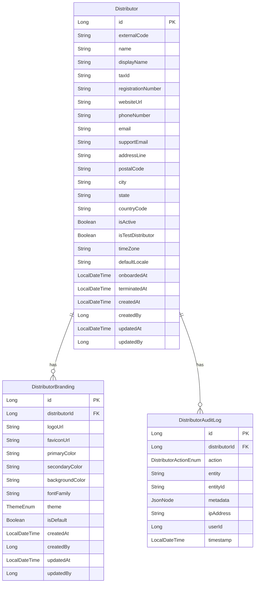

# Firefly Platform - Distributor Management Service

A microservice for managing distributors who resell financial products such as lending services within the Firefly Platform ecosystem.

## Table of Contents

- [Overview](#overview)
- [Architecture](#architecture)
- [Data Model](#data-model)
- [Setup and Installation](#setup-and-installation)
- [Quick Start Guide](#quick-start-guide)
- [API Documentation](#api-documentation)
  - [Usage Examples](#usage-examples)
- [Development Guidelines](#development-guidelines)
- [License](#license)

## Overview

The Distributor Management Service is a core component of the Firefly Platform, responsible for managing distributors who resell financial products. This service provides comprehensive functionality for creating, updating, and managing distributors, their branding configurations, and audit logs.

Key features include:
- Distributor lifecycle management (creation, updates, termination)
- Customizable branding configurations for distributors
- Comprehensive audit logging for all distributor-related actions
- RESTful API for integration with other services

## Architecture

The service follows a modular architecture with clear separation of concerns:

```
common-platform-distributor-mgmt/
├── common-platform-distributor-mgmt-core/       # Business logic and service implementations
├── common-platform-distributor-mgmt-interfaces/ # DTOs and public interfaces
├── common-platform-distributor-mgmt-models/     # Data entities and repositories
├── common-platform-distributor-mgmt-sdk/        # Client SDK for other services
└── common-platform-distributor-mgmt-web/        # REST API controllers and web configuration
```

The service is built using:
- Spring Boot for application framework
- Spring WebFlux for reactive programming
- Spring Data R2DBC for reactive database access
- PostgreSQL for data storage
- Flyway for database migrations

## Data Model

The service manages the following core entities:



### Enumerations

- **ThemeEnum**: Defines the theme options for distributor branding
  - `LIGHT`
  - `DARK`
  - `CUSTOM`

- **DistributorActionEnum**: Defines the types of actions recorded in audit logs
  - `CREATED`
  - `UPDATED`
  - `TERMINATED`

## Setup and Installation

### Prerequisites

- JDK 17 or higher
- Maven 3.8 or higher
- PostgreSQL 13 or higher

### Building the Service

```bash
# Clone the repository
git clone https://github.com/firefly-platform/common-platform-distributor-mgmt.git
cd common-platform-distributor-mgmt

# Build the project
mvn clean install
```

### Configuration

The service can be configured through the `application.yaml` file located in the `common-platform-distributor-mgmt-web/src/main/resources` directory.

Key configuration properties:

```yaml
spring:
  r2dbc:
    url: r2dbc:postgresql://localhost:5432/distributor_mgmt
    username: postgres
    password: postgres
  flyway:
    url: jdbc:postgresql://localhost:5432/distributor_mgmt
    user: postgres
    password: postgres
```

### Running the Service

```bash
# Run the service
cd common-platform-distributor-mgmt-web
mvn spring-boot:run
```

## Quick Start Guide

This guide will help you get started with the Distributor Management Service quickly, covering the most common operations.

### Setting Up Your First Distributor

1. **Start the service** as described in the [Setup and Installation](#setup-and-installation) section.

2. **Create a new distributor** by sending a POST request to `/api/v1/distributors`:

```bash
curl -X POST http://localhost:8080/api/v1/distributors \
  -H "Content-Type: application/json" \
  -d '{
    "name": "Acme Financial Services",
    "displayName": "Acme Finance",
    "taxId": "123456789",
    "registrationNumber": "REG123456",
    "websiteUrl": "https://acmefinance.example.com",
    "phoneNumber": "+1-555-123-4567",
    "email": "contact@acmefinance.example.com",
    "supportEmail": "support@acmefinance.example.com",
    "addressLine": "123 Finance Street",
    "postalCode": "10001",
    "city": "New York",
    "state": "NY",
    "countryCode": "US",
    "isActive": true,
    "isTestDistributor": false,
    "timeZone": "America/New_York",
    "defaultLocale": "en-US"
  }'
```

3. **Set up branding** for your distributor by sending a POST request to `/api/v1/distributors/{distributorId}/brandings`:

```bash
curl -X POST http://localhost:8080/api/v1/distributors/1/brandings \
  -H "Content-Type: application/json" \
  -d '{
    "logoUrl": "https://acmefinance.example.com/logo.png",
    "faviconUrl": "https://acmefinance.example.com/favicon.ico",
    "primaryColor": "#4285F4",
    "secondaryColor": "#34A853",
    "backgroundColor": "#FFFFFF",
    "fontFamily": "Roboto, sans-serif",
    "theme": "LIGHT",
    "isDefault": true
  }'
```

### Common Workflows

#### Distributor Lifecycle Management

1. **Create a distributor** (as shown above)
2. **Update distributor details** when information changes:

```bash
curl -X PUT http://localhost:8080/api/v1/distributors/1 \
  -H "Content-Type: application/json" \
  -d '{
    "id": 1,
    "name": "Acme Financial Services",
    "displayName": "Acme Finance",
    "phoneNumber": "+1-555-123-9999",  # Updated phone number
    "email": "new-contact@acmefinance.example.com",  # Updated email
    "isActive": true
    # Include other fields as needed
  }'
```

3. **Terminate a distributor** by updating its status and setting a termination date:

```bash
curl -X PUT http://localhost:8080/api/v1/distributors/1 \
  -H "Content-Type: application/json" \
  -d '{
    "id": 1,
    "isActive": false,
    "terminatedAt": "2023-12-31T23:59:59"
    # Include other required fields
  }'
```

#### Branding Management

1. **Create branding** (as shown above)
2. **Update branding** when the distributor's visual identity changes:

```bash
curl -X PUT http://localhost:8080/api/v1/distributors/1/brandings/1 \
  -H "Content-Type: application/json" \
  -d '{
    "id": 1,
    "distributorId": 1,
    "primaryColor": "#1976D2",  # Updated primary color
    "secondaryColor": "#388E3C",  # Updated secondary color
    "theme": "CUSTOM"  # Changed theme
    # Include other fields as needed
  }'
```

#### Audit Logging

1. **Create an audit log entry** when significant actions occur:

```bash
curl -X POST http://localhost:8080/api/v1/distributors/1/audit-logs \
  -H "Content-Type: application/json" \
  -d '{
    "distributorId": 1,
    "action": "UPDATED",
    "entity": "DISTRIBUTOR",
    "entityId": "1",
    "metadata": {
      "changedFields": ["phoneNumber", "email"],
      "reason": "Contact information update"
    },
    "userId": 1001
  }'
```

2. **Query audit logs** to review the history of changes:

```bash
curl -X POST http://localhost:8080/api/v1/distributors/1/audit-logs/filter \
  -H "Content-Type: application/json" \
  -d '{
    "filters": {
      "action": "UPDATED"
    },
    "page": 0,
    "size": 10,
    "sort": [
      {
        "field": "timestamp",
        "direction": "DESC"
      }
    ]
  }'
```

## API Documentation

The service provides a RESTful API with the following main endpoints:

### Distributor Endpoints

- `POST /api/v1/distributors` - Create a new distributor
- `GET /api/v1/distributors/{distributorId}` - Get distributor by ID
- `PUT /api/v1/distributors/{distributorId}` - Update distributor
- `DELETE /api/v1/distributors/{distributorId}` - Delete distributor
- `POST /api/v1/distributors/filter` - Filter distributors

### Distributor Branding Endpoints

- `POST /api/v1/distributors/{distributorId}/brandings` - Create a new branding configuration
- `GET /api/v1/distributors/{distributorId}/brandings/{brandingId}` - Get branding by ID
- `PUT /api/v1/distributors/{distributorId}/brandings/{brandingId}` - Update branding
- `DELETE /api/v1/distributors/{distributorId}/brandings/{brandingId}` - Delete branding
- `POST /api/v1/distributors/{distributorId}/brandings/filter` - Filter branding configurations

### Distributor Audit Log Endpoints

- `POST /api/v1/distributors/{distributorId}/audit-logs` - Create a new audit log entry
- `GET /api/v1/distributors/{distributorId}/audit-logs/{auditLogId}` - Get audit log by ID
- `PUT /api/v1/distributors/{distributorId}/audit-logs/{auditLogId}` - Update audit log
- `DELETE /api/v1/distributors/{distributorId}/audit-logs/{auditLogId}` - Delete audit log
- `POST /api/v1/distributors/{distributorId}/audit-logs/filter` - Filter audit logs

Detailed API documentation is available through Swagger UI at `/swagger-ui.html` when the service is running.

### Usage Examples

Below are detailed examples of how to use the API for common scenarios, including request and response payloads.

#### Creating and Managing Distributors

**Example 1: Creating a new distributor**

Request:
```http
POST /api/v1/distributors
Content-Type: application/json

{
  "name": "Global Finance Partners",
  "displayName": "GFP",
  "taxId": "987654321",
  "registrationNumber": "GFP2023-456",
  "websiteUrl": "https://globalfinancepartners.example.com",
  "phoneNumber": "+1-555-987-6543",
  "email": "info@gfp.example.com",
  "supportEmail": "support@gfp.example.com",
  "addressLine": "789 Global Avenue",
  "postalCode": "94105",
  "city": "San Francisco",
  "state": "CA",
  "countryCode": "US",
  "isActive": true,
  "isTestDistributor": false,
  "timeZone": "America/Los_Angeles",
  "defaultLocale": "en-US"
}
```

Response:
```json
{
  "id": 2,
  "name": "Global Finance Partners",
  "displayName": "GFP",
  "taxId": "987654321",
  "registrationNumber": "GFP2023-456",
  "websiteUrl": "https://globalfinancepartners.example.com",
  "phoneNumber": "+1-555-987-6543",
  "email": "info@gfp.example.com",
  "supportEmail": "support@gfp.example.com",
  "addressLine": "789 Global Avenue",
  "postalCode": "94105",
  "city": "San Francisco",
  "state": "CA",
  "countryCode": "US",
  "isActive": true,
  "isTestDistributor": false,
  "timeZone": "America/Los_Angeles",
  "defaultLocale": "en-US",
  "createdAt": "2023-09-15T14:30:45.123Z",
  "createdBy": 1001,
  "updatedAt": null,
  "updatedBy": null,
  "onboardedAt": "2023-09-15T14:30:45.123Z",
  "terminatedAt": null
}
```

**Example 2: Filtering distributors by criteria**

Request:
```http
POST /api/v1/distributors/filter
Content-Type: application/json

{
  "filters": {
    "isActive": true,
    "countryCode": "US"
  },
  "page": 0,
  "size": 10,
  "sort": [
    {
      "field": "name",
      "direction": "ASC"
    }
  ]
}
```

Response:
```json
{
  "content": [
    {
      "id": 1,
      "name": "Acme Financial Services",
      "displayName": "Acme Finance",
      "countryCode": "US",
      "isActive": true,
      "createdAt": "2023-09-10T09:15:30.456Z",
      "...": "other fields omitted for brevity"
    },
    {
      "id": 2,
      "name": "Global Finance Partners",
      "displayName": "GFP",
      "countryCode": "US",
      "isActive": true,
      "createdAt": "2023-09-15T14:30:45.123Z",
      "...": "other fields omitted for brevity"
    }
  ],
  "pageable": {
    "pageNumber": 0,
    "pageSize": 10,
    "sort": [
      {
        "property": "name",
        "direction": "ASC"
      }
    ]
  },
  "totalElements": 2,
  "totalPages": 1,
  "last": true,
  "first": true,
  "size": 10,
  "number": 0,
  "numberOfElements": 2,
  "empty": false
}
```

#### Branding Configuration

**Example 1: Creating a dark theme branding**

Request:
```http
POST /api/v1/distributors/2/brandings
Content-Type: application/json

{
  "logoUrl": "https://globalfinancepartners.example.com/logo-white.png",
  "faviconUrl": "https://globalfinancepartners.example.com/favicon.ico",
  "primaryColor": "#2196F3",
  "secondaryColor": "#FFC107",
  "backgroundColor": "#121212",
  "fontFamily": "Montserrat, sans-serif",
  "theme": "DARK",
  "isDefault": true
}
```

Response:
```json
{
  "id": 2,
  "distributorId": 2,
  "logoUrl": "https://globalfinancepartners.example.com/logo-white.png",
  "faviconUrl": "https://globalfinancepartners.example.com/favicon.ico",
  "primaryColor": "#2196F3",
  "secondaryColor": "#FFC107",
  "backgroundColor": "#121212",
  "fontFamily": "Montserrat, sans-serif",
  "theme": "DARK",
  "isDefault": true,
  "createdAt": "2023-09-15T15:10:22.789Z",
  "createdBy": 1001,
  "updatedAt": null,
  "updatedBy": null
}
```

**Example 2: Getting all branding configurations for a distributor**

Request:
```http
POST /api/v1/distributors/2/brandings/filter
Content-Type: application/json

{
  "filters": {},
  "page": 0,
  "size": 10,
  "sort": [
    {
      "field": "createdAt",
      "direction": "DESC"
    }
  ]
}
```

Response:
```json
{
  "content": [
    {
      "id": 2,
      "distributorId": 2,
      "logoUrl": "https://globalfinancepartners.example.com/logo-white.png",
      "theme": "DARK",
      "isDefault": true,
      "createdAt": "2023-09-15T15:10:22.789Z",
      "...": "other fields omitted for brevity"
    }
  ],
  "pageable": {
    "pageNumber": 0,
    "pageSize": 10,
    "sort": [
      {
        "property": "createdAt",
        "direction": "DESC"
      }
    ]
  },
  "totalElements": 1,
  "totalPages": 1,
  "last": true,
  "first": true,
  "size": 10,
  "number": 0,
  "numberOfElements": 1,
  "empty": false
}
```

#### Audit Logging

**Example 1: Recording a branding update**

Request:
```http
POST /api/v1/distributors/2/audit-logs
Content-Type: application/json

{
  "distributorId": 2,
  "action": "UPDATED",
  "entity": "DISTRIBUTOR_BRANDING",
  "entityId": "2",
  "metadata": {
    "changedFields": ["primaryColor", "secondaryColor"],
    "previousValues": {
      "primaryColor": "#2196F3",
      "secondaryColor": "#FFC107"
    },
    "newValues": {
      "primaryColor": "#1565C0",
      "secondaryColor": "#FFB300"
    },
    "reason": "Brand refresh"
  },
  "ipAddress": "192.168.1.100",
  "userId": 1001
}
```

Response:
```json
{
  "id": 3,
  "distributorId": 2,
  "action": "UPDATED",
  "entity": "DISTRIBUTOR_BRANDING",
  "entityId": "2",
  "metadata": {
    "changedFields": ["primaryColor", "secondaryColor"],
    "previousValues": {
      "primaryColor": "#2196F3",
      "secondaryColor": "#FFC107"
    },
    "newValues": {
      "primaryColor": "#1565C0",
      "secondaryColor": "#FFB300"
    },
    "reason": "Brand refresh"
  },
  "ipAddress": "192.168.1.100",
  "userId": 1001,
  "timestamp": "2023-09-15T16:45:33.456Z"
}
```

**Example 2: Querying audit logs for a specific action type**

Request:
```http
POST /api/v1/distributors/2/audit-logs/filter
Content-Type: application/json

{
  "filters": {
    "action": "UPDATED",
    "entity": "DISTRIBUTOR_BRANDING"
  },
  "page": 0,
  "size": 10,
  "sort": [
    {
      "field": "timestamp",
      "direction": "DESC"
    }
  ]
}
```

Response:
```json
{
  "content": [
    {
      "id": 3,
      "distributorId": 2,
      "action": "UPDATED",
      "entity": "DISTRIBUTOR_BRANDING",
      "entityId": "2",
      "metadata": {
        "changedFields": ["primaryColor", "secondaryColor"],
        "reason": "Brand refresh",
        "...": "other metadata omitted for brevity"
      },
      "userId": 1001,
      "timestamp": "2023-09-15T16:45:33.456Z",
      "...": "other fields omitted for brevity"
    }
  ],
  "pageable": {
    "pageNumber": 0,
    "pageSize": 10,
    "sort": [
      {
        "property": "timestamp",
        "direction": "DESC"
      }
    ]
  },
  "totalElements": 1,
  "totalPages": 1,
  "last": true,
  "first": true,
  "size": 10,
  "number": 0,
  "numberOfElements": 1,
  "empty": false
}
```

## Development Guidelines

### Code Style

This project follows the Google Java Style Guide. Please ensure your code adheres to these guidelines before submitting pull requests.

### Testing

All new features and bug fixes should include appropriate unit and integration tests. Run tests using:

```bash
mvn test
```

### Branching Strategy

- `main` - Production-ready code
- `develop` - Integration branch for features
- `feature/*` - Feature branches
- `bugfix/*` - Bug fix branches
- `release/*` - Release preparation branches

### Commit Messages

Follow the conventional commits specification for commit messages:

```
<type>(<scope>): <description>

[optional body]

[optional footer(s)]
```

Types: feat, fix, docs, style, refactor, test, chore

## License

This project is licensed under the [Apache License 2.0](LICENSE).
